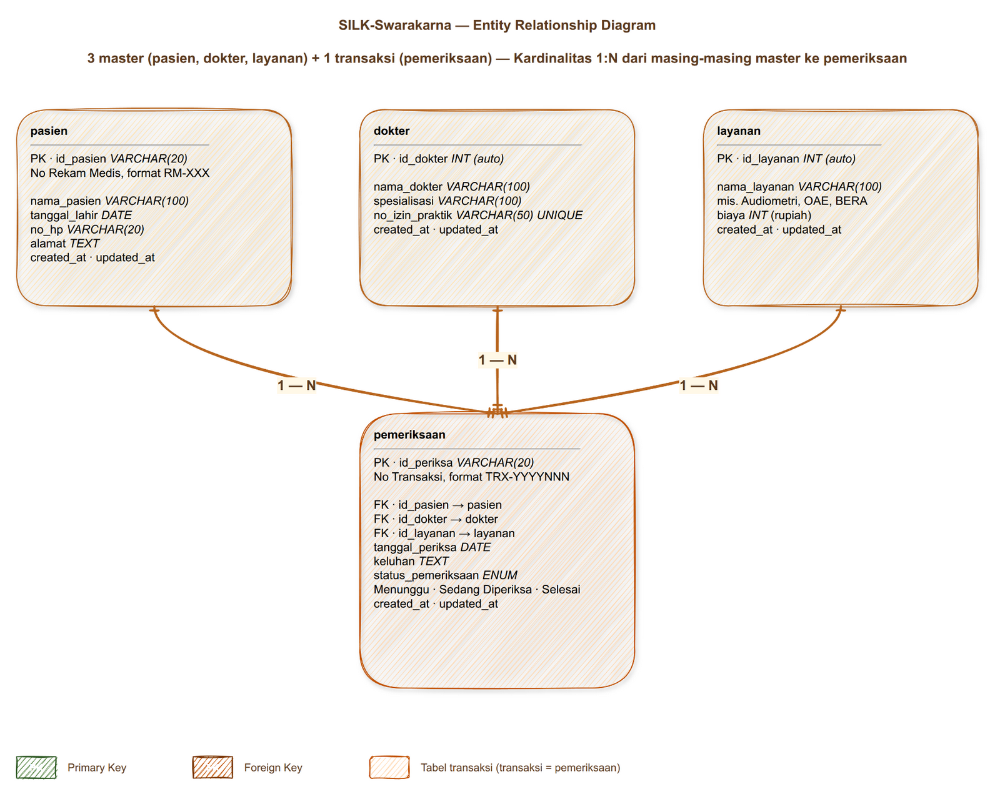
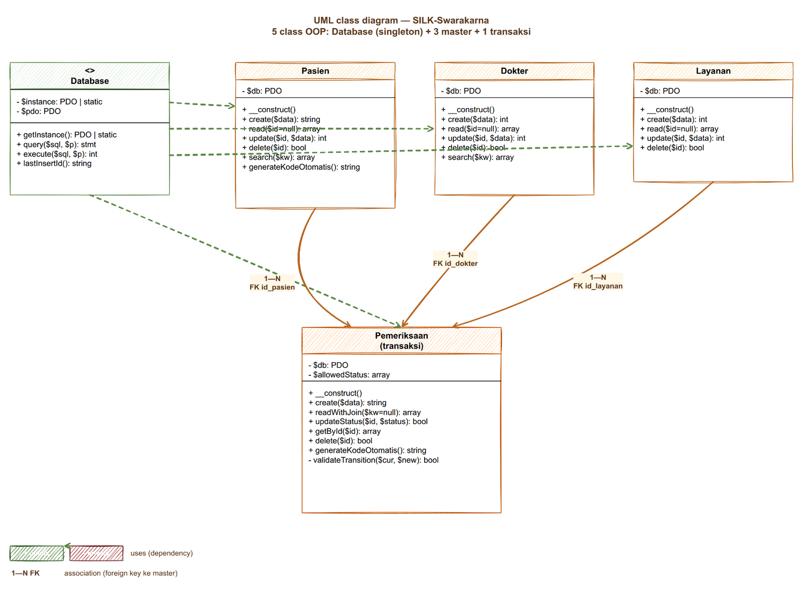
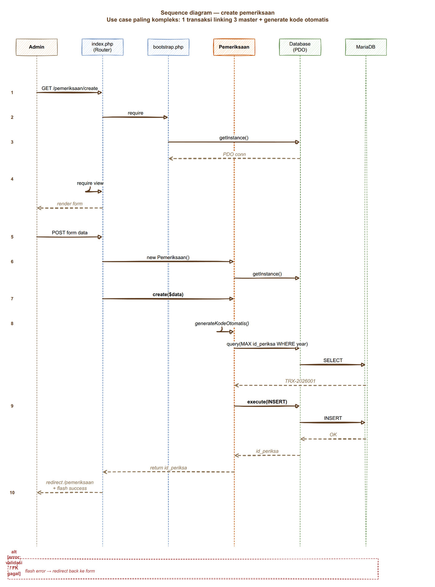
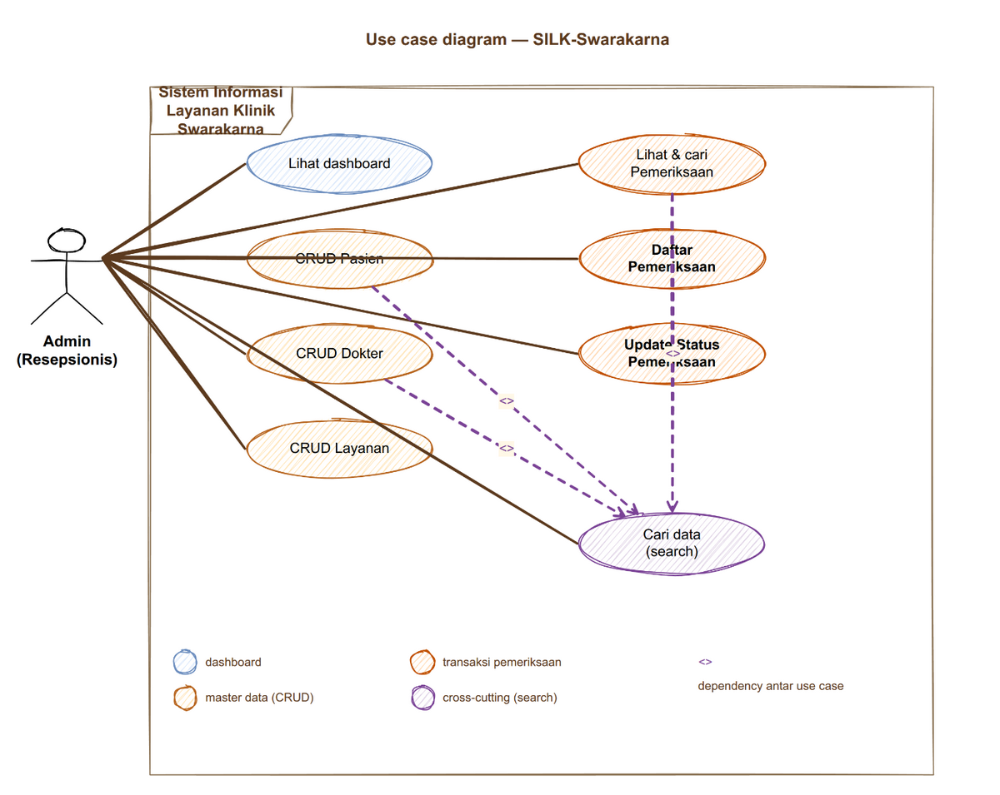
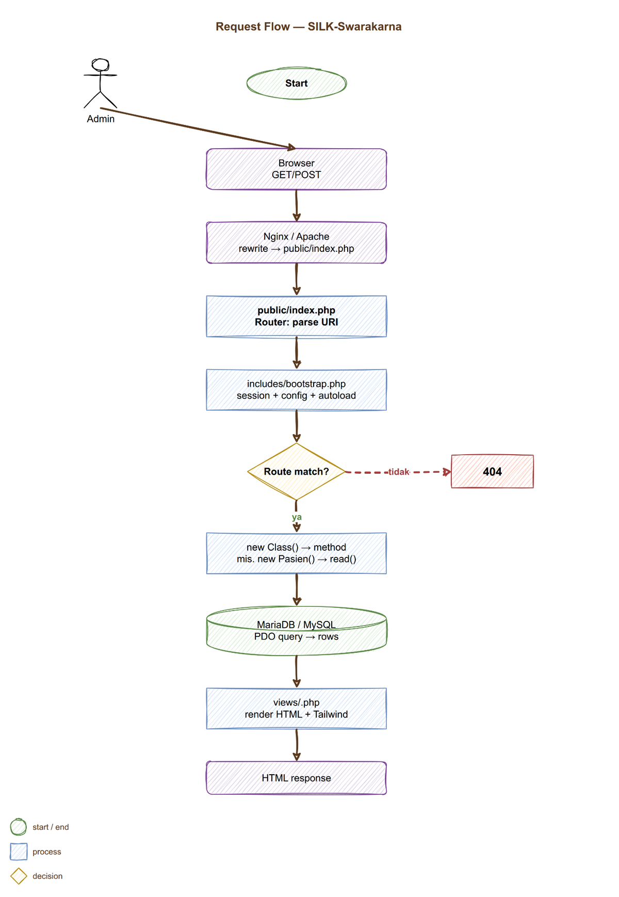

# SILK-Swarakarna

Sistem Informasi Layanan Klinik Swarakarna. Aplikasi web PHP OOP untuk klinik THT spesialis pendengaran dan keseimbangan. UAS Pemrograman Web, Pagi 01, Primakara University.

## Daftar Isi

1. [Ringkasan](#ringkasan)
2. [Entity relationship diagram](#entity-relationship-diagram)
3. [UML diagrams](#uml-diagrams)
4. [Alur request](#alur-request)
5. [Struktur proyek](#struktur-proyek)
6. [Quick start](#quick-start)
7. [Tech stack](#tech-stack)
8. [Sprint roadmap](#sprint-roadmap)
9. [Domain reference](#domain-reference)
10. [Deployment](#deployment)

## Ringkasan

| Aspek | Detail |
|---|---|
| Topik | Sistem Klinik (varian: Klinik THT Swarakarna) |
| Use case | Pendaftaran pasien, manajemen dokter/layanan, pencatatan transaksi pemeriksaan |
| Actor | Admin / Resepsionis klinik (1 role) |
| Master data | 3 (pasien, dokter, layanan) |
| Transaksi | 1 (pemeriksaan, relasi ke 3 master) |
| Tabel DB | 4 |
| Class OOP | 5 (Database + 4 entity) |
| Pattern | Front controller + PDO singleton + MVC ringan |
| Output | Web app native PHP, tanpa framework |

## Entity relationship diagram



Sumber: [docs/diagrams/erd.drawio](docs/diagrams/erd.drawio). Edit di [app.diagrams.net](https://app.diagrams.net) atau draw.io desktop.

| Tabel | Tipe | Primary key | Foreign key | Catatan |
|---|---|---|---|---|
| `pasien` | Master | `id_pasien` VARCHAR, `RM-XXX` | | Kode otomatis |
| `dokter` | Master | `id_dokter` INT auto | | `no_izin_praktik` UNIQUE |
| `layanan` | Master | `id_layanan` INT auto | | `biaya` IDR integer |
| `pemeriksaan` | Transaksi | `id_periksa` VARCHAR, `TRX-YYYYNNN` | `id_pasien`, `id_dokter`, `id_layanan` | `status_pemeriksaan` ENUM |

FK constraint: `ON DELETE RESTRICT`. Master yang sudah punya riwayat pemeriksaan tidak bisa dihapus. Setelah `status_pemeriksaan = 'Selesai'`, baris `pemeriksaan` immutable untuk audit trail.

## UML diagrams

### Class diagram

5 class OOP, atribut + method, relasi dependency ke Database singleton + association 1:N dari 3 master ke Pemeriksaan.



Sumber: [docs/diagrams/uml-class.drawio](docs/diagrams/uml-class.drawio).

### Sequence diagram: create pemeriksaan

Use case paling kompleks. 6 lifeline (Admin, index.php, bootstrap, Pemeriksaan, Database, MariaDB), 10 step dari GET form sampai INSERT.



Sumber: [docs/diagrams/uml-sequence.drawio](docs/diagrams/uml-sequence.drawio).

### Use case diagram

1 actor (Admin), 8 use case, 3 `<<include>>` dependency ke "Cari data (search)".



Sumber: [docs/diagrams/uml-usecase.drawio](docs/diagrams/uml-usecase.drawio).

## Alur request



Sumber: [docs/diagrams/flowchart.drawio](docs/diagrams/flowchart.drawio).

Singkatnya:

```
User → Browser → Nginx/Apache → public/index.php (router)
  → includes/bootstrap.php (session + config + autoload)
  → match route → new Class() → method
  → Database::getInstance() → MariaDB
  → views/<page>.php (render HTML + Tailwind)
  → HTML response
```

Detail per layer ada di [docs/architecture.md](docs/architecture.md).

## Struktur proyek

```
silk-swarakarna-uas/
├── .ddev/                              DDEV config (PHP 8.2, MariaDB 10.11)
│
├── public/                             Document root
│   ├── index.php                       Front controller + router
│   ├── .htaccess                       URL rewrite
│   └── assets/css/
│
├── src/                                Domain layer (5 class OOP)
│   ├── Database.php                    PDO singleton
│   ├── Pasien.php                      CRUD + generateKodeOtomatis
│   ├── Dokter.php                      CRUD
│   ├── Layanan.php                     CRUD
│   └── Pemeriksaan.php                 Transaksi + JOIN + status
│
├── includes/                           Bootstrap layer
│   ├── bootstrap.php                   session + autoload + error handler
│   └── config.php                      Env loader (.env)
│
├── views/                              Presentation layer
│   ├── layout/{header,footer}.php      Shell HTML + Tailwind
│   ├── dashboard.php
│   ├── pasien/  dokter/  layanan/  pemeriksaan/
│
├── database/
│   └── silk_swarakarna.sql             Schema + seed (3 pasien, 3 dokter, 4 layanan)
│
├── docs/                               Dokumentasi
│   ├── architecture.md                 Request lifecycle + class diagram
│   ├── business-logic.md               Flowchart per fitur
│   ├── diagrams/                       ERD + Flowchart (DrawIO source)
│   └── agents/                         Skill config
│
├── .scratch/silk-swarakarna-uas/       Issue tracker (local markdown)
│   ├── PRD.md
│   └── issues/01..20-*.md
│
├── CONTEXT.md                          Glossary domain
├── AGENTS.md                           Agent runtime config
├── composer.json                       PSR-4 autoload `Silk\` → `src/`
├── .env.example
├── .gitignore
└── README.md
```

## Quick start

Pilih salah satu. DDEV paling cepat karena tidak perlu install PHP lokal.

### Mode A: DDEV (Docker)

Prasyarat: [Docker](https://docs.docker.com/get-docker/) + [DDEV](https://ddev.readthedocs.io/en/latest/).

```bash
git clone git@github.com:TudeOrangBiasa/silk-swarakarna-uas.git
cd silk-swarakarna-uas
ddev start
ddev composer install
ddev import-db --file=database/silk_swarakarna.sql
ddev launch
```

URL: `https://silk-swarakarna-uas.ddev.site/`

Kredensial DB otomatis: `db`/`db` di host `db` dalam container, database `silk_swarakarna`. Env di-inject oleh DDEV lewat `web_environment`, jadi tidak perlu edit `.env`.

### Mode B: baremetal (PHP lokal)

Prasyarat: PHP 8.0+ + extension `pdo_mysql`, Composer, MySQL 5.7+ atau MariaDB 10.3+.

```bash
git clone git@github.com:TudeOrangBiasa/silk-swarakarna-uas.git
cd silk-swarakarna-uas

composer install
cp .env.example .env
# edit .env: DB_HOST, DB_NAME, DB_USER, DB_PASS

mysql -u root -p < database/silk_swarakarna.sql
php -S localhost:8000 -t public/
```

URL: `http://localhost:8000/`

### Mode C: shared hosting (cPanel / public_html)

Prasyarat: akun hosting dengan PHP 8.0+ dan MySQL.

```bash
# 1. Lokal: build artifact (opsional)
composer install --no-dev --optimize-autoloader

# 2. Upload via cPanel File Manager / FTP:
#    - Upload SELURUH isi repo ke /home/user/silk-swarakarna/
#    - Symlink public/ ke /home/user/public_html/
#      atau upload public/ ke public_html/ langsung

# 3. cPanel → MySQL Databases:
#    - Buat database `username_silk_swarakarna`
#    - Buat user + password
#    - Grant ALL

# 4. cPanel → phpMyAdmin:
#    - Import database/silk_swarakarna.sql

# 5. Edit .env di server:
#    DB_HOST=localhost
#    DB_NAME=username_silk_swarakarna
#    DB_USER=username_dbuser
#    DB_PASS=...
#    APP_URL=https://yourdomain.tld
#    APP_DEBUG=false
```

Struktur target di server:

```
/home/user/silk-swarakarna/    {src, includes, views, ...}
/home/user/public_html/         symlink → silk-swarakarna/public/
```

Document root cPanel harus point ke folder `public/`, bukan root repo. Ini penting: kalau root repo yang di-expose, file `.env` dan source code bisa diakses publik.

## Tech stack

| Layer | Teknologi | Versi |
|---|---|---|
| Backend | PHP (OOP, PDO) | 8.2 (DDEV) / 8.0+ minimum |
| Database | MariaDB (DDEV) / MySQL | 10.11 / 5.7+ |
| Web server | nginx-fpm (DDEV) / Apache | |
| Frontend | Tailwind CSS via CDN | 3.x |
| Autoload | Composer PSR-4 | 2.x |
| Dev env | DDEV (Docker) | 1.25+ |
| Version control | Git + GitHub | |

Tidak pakai framework. Sesuai spec UAS: OOP murni, class pisah jelas.

## Sprint roadmap

20 issue, dependency-aware. Detail per issue di [`.scratch/silk-swarakarna-uas/issues/`](.scratch/silk-swarakarna-uas/issues/).

| Wave | Issue | Bisa paralel | Deskripsi |
|---|---|---|---|
| 1 | 01–05 | 5 orang | Foundation: bootstrap, DB, schema, router, layout |
| 2 | 06–09 | 4 orang | Domain classes: Pasien, Dokter, Layanan, Pemeriksaan |
| 3 | 10–17 | 8 orang | Views: list + form per master, create + list untuk transaksi |
| 4 | 18–19 | 2 orang | Dashboard widget + delete handlers |
| 5 | 20 | 1 orang | Final integration + README polish |

Tiap file issue punya:
- `Status: ready-for-agent` (lihat [triage-labels.md](docs/agents/triage-labels.md))
- `Depends:` (issue yang harus selesai dulu)
- `## Files` (file yang harus dibuat)
- `## Acceptance` (checklist testable)
- `## Test` (code snippet)
- `## Out of scope` (batas-batas biar tidak scope creep)

## Domain reference

Glossary lengkap di [CONTEXT.md](CONTEXT.md). Ringkas:

- **Pasien**: orang yang terdaftar di klinik. ID = No Rekam Medis `RM-XXX` (auto-generated, disimpan di kolom `id_pasien`).
- **Dokter**: spesialis THT. ID = `id_dokter` (auto-increment).
- **Layanan**: jenis tes (Audiometri, OAE, BERA, Timpanometri). ID = `id_layanan`. Punya `biaya` (IDR).
- **Pemeriksaan**: transaksi 1 Pasien + 1 Dokter + 1 Layanan pada tanggal tertentu. ID = No Transaksi `TRX-YYYYNNN` (disimpan di kolom `id_periksa`).
- **Status Pemeriksaan**: `Menunggu` → `Sedang Diperiksa` → `Selesai`. Sekali `Selesai`, immutable (audit trail).

## Deployment

| Target | Cocok untuk | Panduan |
|---|---|---|
| Local dev (DDEV) | Pengembangan harian, demo ke dosen | [Mode A](#mode-a-ddev-docker) |
| Local dev (baremetal) | Sudah punya PHP/MySQL di host | [Mode B](#mode-b-baremetal-php-lokal) |
| Shared hosting (cPanel) | Submit UAS, demo publik, portfolio | [Mode C](#mode-c-shared-hosting-cpanel--public_html) |
| VPS (Docker) | Scaling / production real | Di luar scope UAS |

Checklist sebelum submit UAS:

- [ ] Semua 20 issue selesai
- [ ] `ddev start` + `ddev launch` jalan tanpa error
- [ ] `ddev mysql -e "SELECT COUNT(*) FROM pemeriksaan;"` return > 0
- [ ] `ddev import-db --file=database/silk_swarakarna.sql` bisa diulang dari nol
- [ ] README + ERD + Flowchart terbaca
- [ ] `public/` jadi document root (cek `.htaccess` rewrite)

## Kontributor

Tim SILK-Swarakarna, Teknik Informatika Pagi 01, Primakara University. 6 mahasiswa, lihat git log untuk breakdown commit.

Lisensi: MIT. Bebas dipakai untuk akademik, portfolio, atau pembelajaran.
