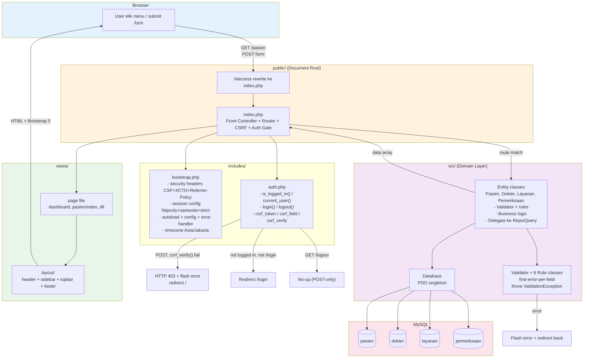
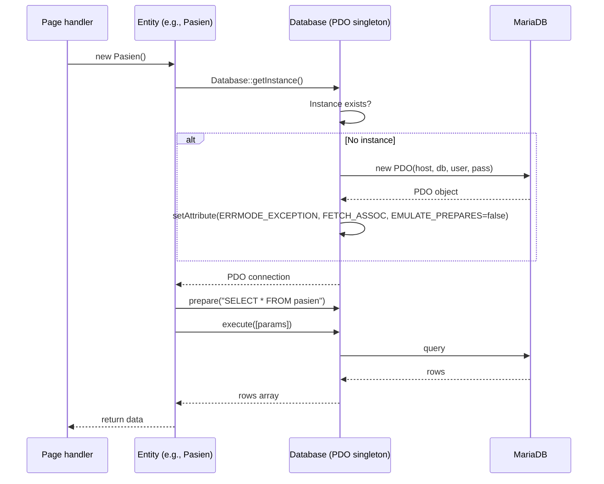

# Architecture

Diagram arsitektur SILK-Swarakarna: struktur direktori, request lifecycle, class diagram.

## 1. Project layout

```
silk-swarakarna/
├── src/
│   ├── Database.php
│   ├── Entity/                     (Silk\Entity\*)
│   │   ├── Pasien.php
│   │   ├── Dokter.php
│   │   ├── Layanan.php
│   │   └── Pemeriksaan.php
│   ├── Repository/                 (Silk\Repository\*)
│   │   ├── PasienRepository.php
│   │   ├── DokterRepository.php
│   │   ├── LayananRepository.php
│   │   └── PemeriksaanRepository.php
│   ├── Query/                      (Silk\Query\*)
│   │   ├── PasienQuery.php
│   │   ├── DokterQuery.php
│   │   ├── LayananQuery.php
│   │   └── PemeriksaanQuery.php
│   ├── Presenter/                  (Silk\Presenter\*)
│   │   ├── PasienPresenter.php
│   │   ├── DokterPresenter.php
│   │   ├── LayananPresenter.php
│   │   └── PemeriksaanPresenter.php
│   ├── Exception/
│   │   └── ValidationException.php | Map field => error message
│   └── Validation/                 (Silk\Validation\*)
│       ├── Validator.php           | Process rules, throw on error
│       └── Rule/                   (Silk\Validation\Rule\*)
│           ├── Rule.php            | Interface
│           ├── Required.php
│           ├── MaxLength.php
│           ├── DateNotFuture.php
│           ├── PhoneFormat.php
│           ├── Enum.php
│           └── PositiveNumber.php
│
├── includes/
│   ├── bootstrap.php               | Security headers, session, autoload, error handler, timezone
│   ├── config.php                  | .env parser
│   ├── helpers.php                 | Tanggal, Rupiah, flash, pagination, old_input, error_for
│   ├── auth.php                    | Login/logout, CSRF token/field/verify
│   └── logger.php                  | Error logger
│
├── public/
│   ├── index.php                   | Front controller + router + CSRF + auth gate
│   ├── .htaccess
│   └── assets/css/app.css          | Design system, 342 baris
│
├── views/                          | Bootstrap 5.3 template
│   ├── layout/
│   │   ├── header.php              | <head>, sidebar, topbar, skip-to-content (26 baris)
│   │   ├── footer.php              | </main>, command palette, sidebar toggle JS
│   │   ├── _sidebar.php            | Dark nav: Utama, Master Data, Transaksi + profile/logout
│   │   └── _topbar.php             | Sticky: toggle, breadcrumb, search button
│   ├── partials/
│   │   ├── _flash.php              | Flash dismissible message
│   │   ├── _sidebar_section.php    | Sidebar section reusable
│   │   ├── _command_palette.php    | cmd+K modal navigasi
│   │   └── pagination.php          | Bootstrap 5 pagination
│   ├── auth/
│   │   └── login.php               | Login form (username + password + CSRF)
│   ├── dashboard.php
│   ├── pasien/                     | CRUD views (index, create, edit, delete)
│   ├── dokter/                     | CRUD views (index, create, edit, delete)
│   ├── layanan/                    | CRUD views (index, create, edit, delete)
│   ├── pemeriksaan/                | Index, create, delete, update_status
│   ├── errors/404.php
│   └── _placeholder.php
│
├── tests/
│   ├── bootstrap.php
│   ├── EntityTestCase.php
│   ├── Auth/                       | Auth flow test
│   ├── Entity/                     | Entity validation + CRUD
│   ├── Repository/
│   ├── Query/
│   └── Presenter/
│
├── database/
│   └── silk_swarakarna.sql         | Schema + seed (4 tabel, trigger)
│
├── docs/                           | Dokumentasi
├── composer.json                   | PSR-4 autoload
├── .env.example
└── .gitignore
```

## 2. Request lifecycle



Urutan eksekusi di `public/index.php`:

1. `require_once bootstrap.php` -- headers, session, autoload, config, error handler, timezone.
2. `require_once auth.php` -- fungsi login/logout/CSRF available.
3. CSRF check: setiap POST wajib lulus `csrf_verify()`. Gagal → HTTP 403 + flash + redirect `/`.
4. Routes table + postActions table defined (dot notation, e.g. `pasien.create`).
5. URL parsed: `?url=` query (Apache) atau `REQUEST_URI` path (nginx/DDEV).
6. Auth gate: `is_logged_in()` kecuali `login`. Gagal → redirect `/login`.
7. POST handler dispatch: kalau `postActions[$routeKey]` match, instantiate entity, call method (`create|update|updateStatus|delete`), redirect list page.
8. `/logout` POST → `logout()` + redirect `/login`. GET no-op.
9. `/login` GET/POST → handle login atau render form.
10. Route resolution → render view file via layout (output-buffered, `old_input` & `errors` unset setelah render).

## 3. Layered architecture

```
views/                   (template HTML, access Presenter only)
  | uses
Presenter/*              (format data for view: pagination, Rupiah, badges, options)
  | uses
Entity/*                 (validation, business rules, state machine, race-safe code gen)
  | composition
  |-- Repository/*       (CRUD: insert/update/delete, simple read single-table)
  |-- Query/*            (complex reads: JOIN, LIKE, computed, row locks, generate code)
  |-- Validator + Rules  (first-error-per-field, throw ValidationException)
  |    | uses
  |    Database (PDO singleton)
  |    | uses
  |    PDO + MariaDB
```

## 4. CQRS rationale

Repository = Command + basic read. Methods:
- `insert()`, `update()`, `delete()` (write)
- `findAll(limit, offset)`, `findById(id)` (simple read, no JOIN, single table)
- `count()` (simple aggregate)

Query = Read. Methods:
- `searchByName(keyword, limit, offset)` + `countSearchByName(keyword)` (LIKE + pagination)
- `findAllJoined(keyword?, limit, offset)` + `countAllJoined(keyword?)` (multi-table JOIN + pagination)
- `findByIdJoined(id)` (single row JOIN)
- `findLatest($limit)` (top-N)
- `findStatusForUpdate($id)` (row-level lock `FOR UPDATE`)
- `generateKodeOtomatis()` (computation: MAX + increment)
- `findPasienForOptions()`, `findDokterForOptions()`, `findLayananForOptions()` (dropdown data)
- `countByDate()`, `getCountByMonth()`, `getTopLayanan()`, `getDokterStats()` (date/grouped aggregates)

Boundary rule: simple read (single table, no JOIN) goes in Repository. JOIN, LIKE, computed values, row locks, code generation go in Query.

`PemeriksaanRepository` is specialized -- `findRaw(id)`, `updateStatus(id, status)`, `deleteIfNotSelesai(id)`, `countByDate(date)`. Tidak punya generic `findAll/findById/update/delete` karena index/show selalu pakai JOIN (via `PemeriksaanQuery`) dan `delete` ada constraint "tidak boleh kalau Selesai".

## 5. Code examples

### Validator usage (Pasien create)

```php
(new Validator())->validate($data, [
    'nama_pasien'      => [new Required('Nama pasien wajib diisi'),
                            new MaxLength('Nama pasien maksimal 100 karakter', 100)],
    'tanggal_lahir'    => [new Required('Tanggal lahir wajib diisi'),
                            new DateNotFuture('Tanggal lahir tidak boleh di masa depan')],
    'jenis_kelamin'    => [new Required('Jenis kelamin wajib diisi'),
                            new Enum(['L', 'P'], 'Jenis kelamin harus Laki-laki (L) atau Perempuan (P)')],
    'pekerjaan'        => [new MaxLength('Pekerjaan maksimal 100 karakter', 100)],
    'golongan_darah'   => [new Enum(['A', 'B', 'AB', 'O'],
                            'Golongan darah harus A, B, AB, atau O')],
    'no_hp'            => [new Required('No HP wajib diisi'),
                            new PhoneFormat('No HP harus 10-15 digit angka')],
    'alamat'           => [new Required('Alamat wajib diisi'),
                            new MaxLength('Alamat maksimal 255 karakter', 255)],
]);
```

Validator iterates field rules. Each rule has `validate(value): ?string`. Returns `null` if valid, error message if invalid. First error per field stops. Throws `ValidationException` with `field => message` map. Router catches it, redirects with flash + old input.

### Race-safe code generation (Pasien create)

```php
$maxAttempts = 3;
for ($attempt = 1; $attempt <= $maxAttempts; $attempt++) {
    $this->db->beginTransaction();
    try {
        $id = $this->query->generateKodeOtomatis();
        $this->repo->insert($id, $data);
        $this->db->commit();
        return $id;
    } catch (PDOException $e) {
        $this->db->rollBack();
        if (!self::isDuplicateKeyError($e)) throw $e;
        if ($attempt === $maxAttempts) {
            throw new \RuntimeException("Gagal generate id unik setelah {$maxAttempts}x percobaan");
        }
    }
}
```

3 retry. Collision = duplicate key → rollback, retry. Non-duplicate error → rethrow immediately. Setelah 3x gagal → RuntimeException. Same pattern dipakai `Pemeriksaan::create` untuk `PRW-XXX`.

### Pemeriksaan updateStatus (race-safe state machine)

```php
public function updateStatus(string $id, string $newStatus): int
{
    $this->db->beginTransaction();
    try {
        $current = $this->query->findStatusForUpdate($id);  // SELECT ... FOR UPDATE
        if ($current === null) {
            throw new RuntimeException("Pemeriksaan {$id} not found");
        }
        $statusErrors = $this->validateStatusTransition($current, $newStatus);
        if ($statusErrors !== []) {
            throw new ValidationException($statusErrors);
        }
        $n = $this->repo->updateStatus($id, $newStatus);
        $this->db->commit();
        return $n;
    } catch (\Throwable $e) {
        $this->db->rollBack();
        throw $e;
    }
}
```

`findStatusForUpdate` locks the row. Two concurrent requests cannot race. Transition validation happens inside the lock. State machine:

```
Menunggu         -> [Sedang Diperiksa, Selesai]
Sedang Diperiksa -> [Menunggu, Selesai]
Selesai          -> [] (terminal)
```

## 6. Class responsibilities

| Class | Responsibility | Methods |
|---|---|---|
| `Database` | PDO singleton, one shared connection | `getInstance()`, `query(sql, params)`, `execute(sql, params)`, `lastInsertId()`, `beginTransaction()`, `commit()`, `rollBack()`, `pdo()` |
| `Entity\Pasien` | Validasi + CRUD + race-safe RM-XXX generation | `generateKodeOtomatis()`, `create(data)`, `read(id?)`, `update(id, data)`, `delete(id)`, `search(keyword)`, `readForOptions()`, `count()` |
| `Entity\Dokter` | Validasi + CRUD (INT auto-increment) | `create(data)`, `read(id?)`, `update(id, data)`, `delete(id)`, `search(keyword)`, `readForOptions()`, `count()` |
| `Entity\Layanan` | Validasi + CRUD (INT auto-increment) | `readForOptions()`, `create(data)`, `read(id?)`, `update(id, data)`, `delete(id)`, `count()` |
| `Entity\Pemeriksaan` | State machine + race-safe code gen + FOR UPDATE | `generateKodeOtomatis()`, `create(data)`, `read(id)`, `readWithJoin(keyword?)`, `getById(id)`, `readLatest(limit)`, `updateStatus(id, newStatus)`, `delete(id)`, `count()`, `countByDate(date)`, `getAllowedTransitions(currentStatus)` |
| `Repository\Pasien` | SQL data access Pasien | `insert(id, data)`, `findAll(limit, offset)`, `findById(id)`, `update(id, data)`, `delete(id)`, `count()` |
| `Repository\Dokter` | SQL data access Dokter | `insert(data)`, `findAll(limit, offset)`, `findById(id)`, `update(id, data)`, `delete(id)`, `count()` |
| `Repository\Layanan` | SQL data access Layanan | `insert(data)`, `findAll(limit, offset)`, `findById(id)`, `update(id, data)`, `delete(id)`, `count()` |
| `Repository\Pemeriksaan` | SQL specialized Pemeriksaan | `insert(data)`, `findRaw(id)`, `updateStatus(id, status)`, `deleteIfNotSelesai(id)`, `count()`, `countByDate(date)` |
| `Query\Pasien` | Complex reads Pasien | `searchByName(keyword, limit, offset)`, `countSearchByName(keyword)`, `findPasienForOptions()`, `generateKodeOtomatis()` |
| `Query\Dokter` | Complex reads Dokter | `searchByName(keyword, limit, offset)`, `countSearchByName(keyword)`, `findDokterForOptions()` |
| `Query\Layanan` | Complex reads Layanan | `findLayananForOptions()` |
| `Query\Pemeriksaan` | Complex reads Pemeriksaan | `generateKodeOtomatis()`, `findAllJoined(keyword?, limit, offset)`, `countAllJoined(keyword?)`, `findByIdJoined(id)`, `findLatest(limit)`, `findStatusForUpdate(id)`, `getCountByMonth(year)`, `getTopLayanan(limit)`, `getDokterStats()` |
| `Presenter\Pasien` | Format data Pasien for view | `getListData(keyword?, page, perPage)`, `getFormData(id?)`, `getOptions()`, `getCount()` |
| `Presenter\Dokter` | Format data Dokter for view | `getListData(keyword?, page, perPage)`, `getFormData(id?)`, `getOptions()`, `getCount()` |
| `Presenter\Layanan` | Format data Layanan for view | `getListData(page, perPage)`, `getFormData(id?)`, `getOptions()`, `getCount()` |
| `Presenter\Pemeriksaan` | Format data Pemeriksaan for view + dashboard | `getListData(keyword?, page, perPage)`, `getFormData(id?)`, `getCount()`, `getCountByDate(date)`, `getDashboardStats()`, `getLatest(limit)`, `getPasienOptions()`, `getDokterOptions()`, `getLayananOptions()`, `getStatusOptions()`, `getAllowedTransitions(currentStatus)` |
| `Validator` | Run rules, throw first-error-per-field | `validate(data, rules)` |
| `Rule\Rule` | Interface | `validate(value): ?string` |
| `Rule\Required` | Field must not be empty | `validate(value)` |
| `Rule\MaxLength` | Max char length | `validate(value)` |
| `Rule\DateNotFuture` | Date <= today | `validate(value)` |
| `Rule\PhoneFormat` | 10-15 digit numeric | `validate(value)` |
| `Rule\Enum` | Must be in allowed list | `validate(value)` |
| `Rule\PositiveNumber` | Number > 0 | `validate(value)` |
| `ValidationException` | Per-field error container | `getErrors()`, `getError(field)`, `addError(field, msg)`, `hasErrors()`, `getFieldErrors()` |
| `auth.php` functions | Login, logout, CSRF | `is_logged_in()`, `current_user()`, `login(username, password)`, `logout()`, `csrf_token()`, `csrf_field()`, `csrf_verify()` |

## 7. Composer autoload (PSR-4)

```json
"autoload": {
    "psr-4": {
        "Silk\\": "src/",
        "Silk\\Includes\\": "includes/",
        "Silk\\Entity\\": "src/Entity/",
        "Silk\\Repository\\": "src/Repository/",
        "Silk\\Presenter\\": "src/Presenter/",
        "Silk\\Query\\": "src/Query/",
        "Tests\\": "tests/"
    }
}
```

`Silk\Exception\ValidationException` and `Silk\Validation\*` resolved by `Silk\` -> `src/` mapping. `Tests\\` -> `tests/` untuk test classes.

## 8. Security

All security config in `includes/bootstrap.php` and `includes/auth.php`.

### HTTP headers

Set before any output in bootstrap.php:

- `X-Content-Type-Options: nosniff` -- prevent MIME sniffing
- `Content-Security-Policy: default-src 'self'; style-src 'self' 'unsafe-inline' https://cdn.jsdelivr.net; script-src 'self' 'unsafe-inline' https://cdn.jsdelivr.net; font-src 'self' https://cdn.jsdelivr.net data:; img-src 'self' data:; connect-src 'self'; form-action 'self'; base-uri 'self'; frame-ancestors 'none'` -- restrict script/style/font sources to self + CDN (jsdelivr), block frames, restrict form-action
- `Referrer-Policy: strict-origin-when-cross-origin`

### Session config

- `session.cookie_httponly = 1` -- JS cannot access session cookie
- `session.cookie_samesite = Lax` -- CSRF protection baseline
- `session.use_strict_mode = 1` -- reject uninitialized session IDs

### Auth flow

1. `bootstrap.php` loads first: security headers + session config + autoload.
2. `auth.php` loaded. Functions available.
3. CSRF check: every POST must pass `csrf_verify()` with `hash_equals` constant-time compare. Fail → HTTP 403 + flash + redirect.
4. Auth gate: `is_logged_in()` for every route except `/login`. Unauthenticated → redirect `/login`.
5. Login validates hardcoded `admin` / bcrypt hash (`ADMIN_USERNAME`, `ADMIN_PASSWORD_HASH` constants). On success: `session_regenerate_id(true)` (prevent fixation), set `user_id` + `username`.
6. Logout: POST-only. GET `/logout` no-op. POST destroys session + clears cookie.
7. All forms include `<?= csrf_field() ?>` hidden input.

### CSRF token

- One token per session, `bin2hex(random_bytes(32))`, stored `$_SESSION['csrf_token']`.
- Generated on first call to `csrf_token()`, reused for the session lifetime.
- Verified via `hash_equals($_SESSION['csrf_token'], $_POST['csrf_token'])` constant-time.

### Error handler

PHP errors (notice, warning, deprecation) → `ErrorException` via `set_error_handler`. Caught upstream like any other exception. Display errors off in production, on when `APP_DEBUG`.

## 9. Frontend

### Topbar

Sticky header in `views/layout/_topbar.php`. Left: toggle button (`bi-list` icon, `#topbarToggle`). Middle: auto-generated breadcrumb from URL path. Right: search button (`bi-search` icon + "Cari atau navigasi..." placeholder) with `title="Tekan ⌘K untuk mencari"`.

Breadcrumb segments:
- Always: Dashboard (root)
- If path matches `pasien|dokter|layanan|pemeriksaan`: section label (Master Data or Transaksi) + entity name (linked to list)
- If path has action: action label (Tambah, Edit, Hapus, Update Status)

Toggle behavior (inline script in footer.php):
- Mobile (<992px): opens sidebar as offcanvas drawer
- Desktop (>=992px): toggles sidebar collapse (60px icons-only mode)

### Sidebar

`views/layout/_sidebar.php`. Three sections via `views/partials/_sidebar_section.php`:

```
Utama        : Dashboard
Master Data  : Pasien, Dokter, Layanan
Transaksi    : Pemeriksaan
```

Active state: current URL matches item URL → 3px teal border + bg highlight. Otherwise muted text.

Sidebar layout: brand at top (desktop only, hidden on mobile via `d-none d-lg-flex`), 3 sections in scrollable flex-grow area, profile + logout at bottom (sticky, always visible). Mobile: offcanvas drawer via Bootstrap `.offcanvas-lg.offcanvas-start`.

### Sidebar collapse

CSS class `sidebar-collapsed` on `<html>`. State persisted in `localStorage('sidebar-collapsed')` as `'0'` or `'1'`. Inline script in `header.php` applies class before CSS loads → no FOUC.

Collapsed mode: sidebar shrinks to 60px, text + labels hidden, icons centered, logout button becomes circular (no text), brand text hidden.

### Command palette

`views/partials/_command_palette.php`. Bootstrap modal `#commandPalette` with search input. Triggered by `cmd+K` (Mac) or `ctrl+K` (Win/Linux) via keydown listener. 5 nav items (Dashboard, Pasien, Dokter, Layanan, Pemeriksaan) with icon + label. Filter as you type (case-insensitive substring match). Enter navigates to first visible item. Esc closes (Bootstrap default). Click navigates.

Reset on `shown.bs.modal`: input cleared, all items visible, input focused.

## 10. Database connection pattern



Singleton PDO. One connection shared across all classes. Private constructor + private clone + throw-on-unserialize. `pdo()` exposed for advanced use (migrations, raw queries); prefer `query()` / `execute()` / `lastInsertId()` for normal operations.
