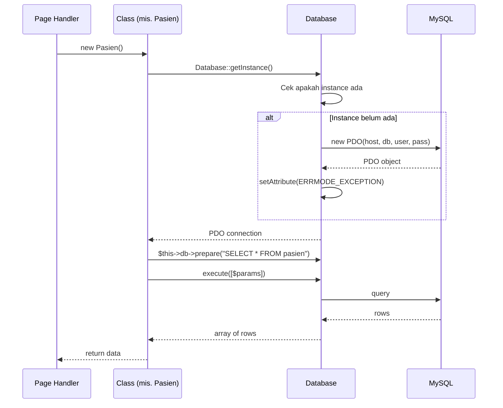

# Architecture

Diagram arsitektur SILK-Swarakarna: struktur direktori + request lifecycle.

## 1. Project Layout

```
silk-swarakarna/
├── public/                          ← Document root (Apache/Nginx point ke sini)
│   ├── index.php                    ← Front controller + router
│   ├── .htaccess                    ← URL rewrite (semua → index.php)
│   └── assets/
│       ├── css/                     ← Tailwind output
│       ├── js/
│       └── img/
│
├── src/                             ← Domain layer (OOP classes)
│   ├── Database.php                 ← Class Database (PDO singleton)
│   ├── Pasien.php                   ← Class Pasien (master)
│   ├── Dokter.php                   ← Class Dokter (master)
│   ├── Layanan.php                  ← Class Layanan (master)
│   └── Pemeriksaan.php              ← Class Pemeriksaan (transaksi)
│
├── includes/                        ← Bootstrap + config
│   ├── bootstrap.php                ← Autoload + session + error handler
│   └── config.php                   ← DB credentials, base URL
│
├── views/                           ← Presentation layer
│   ├── layout/
│   │   ├── header.php               ← <html> + Tailwind + navbar
│   │   └── footer.php               ← </body> + scripts
│   ├── dashboard.php
│   ├── pasien/
│   │   ├── index.php                ← List + search
│   │   ├── create.php               ← Form tambah
│   │   ├── edit.php                 ← Form edit
│   │   └── delete.php               ← Handler hapus
│   ├── dokter/
│   ├── layanan/
│   └── pemeriksaan/
│       ├── index.php                ← List + JOIN 3 master + search
│       ├── create.php               ← Form dropdown 3 master
│       ├── update_status.php        ← Quick action ganti status
│       └── delete.php
│
├── database/
│   ├── silk_swarakarna.sql          ← Schema + seed
│   └── migrations/                  ← Optional: incremental SQL
│
├── .env                             ← DB creds (GITIGNORED)
├── .env.example                     ← Template
├── .gitignore
├── README.md
└── composer.json                    ← PSR-4 autoload "Silk\\"
```

## 2. Request Lifecycle

Setiap HTTP request dari browser flow-nya gini:


## 3. Class Responsibilities

| Class | Tanggung Jawab | Methods |
|---|---|---|
| `Database` | Koneksi PDO, eksekusi query global | `getInstance()`, `query()`, `execute()`, `lastInsertId()` |
| `Pasien` | CRUD master pasien + kode otomatis | `create()`, `read()`, `update()`, `delete()`, `generateKodeOtomatis()`, `search()` |
| `Dokter` | CRUD master dokter | `create()`, `read()`, `update()`, `delete()`, `search()` |
| `Layanan` | CRUD master layanan THT | `create()`, `read()`, `update()`, `delete()` |
| `Pemeriksaan` | Transaksi + JOIN + status | `create()`, `readWithJoin()`, `updateStatus()`, `search()`, `getById()` |

## 4. Database Connection Pattern



Pattern: **Singleton PDO**. 1 koneksi shared di semua class — hemat resource, gampang di-mock untuk test.
