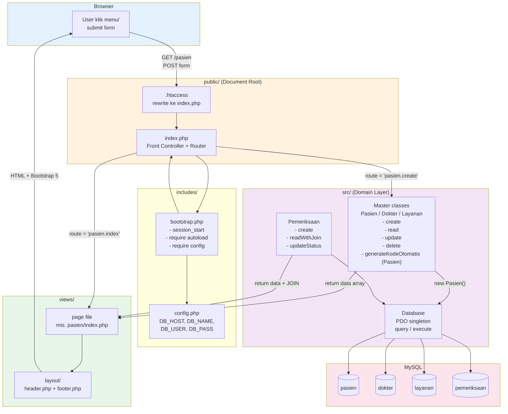
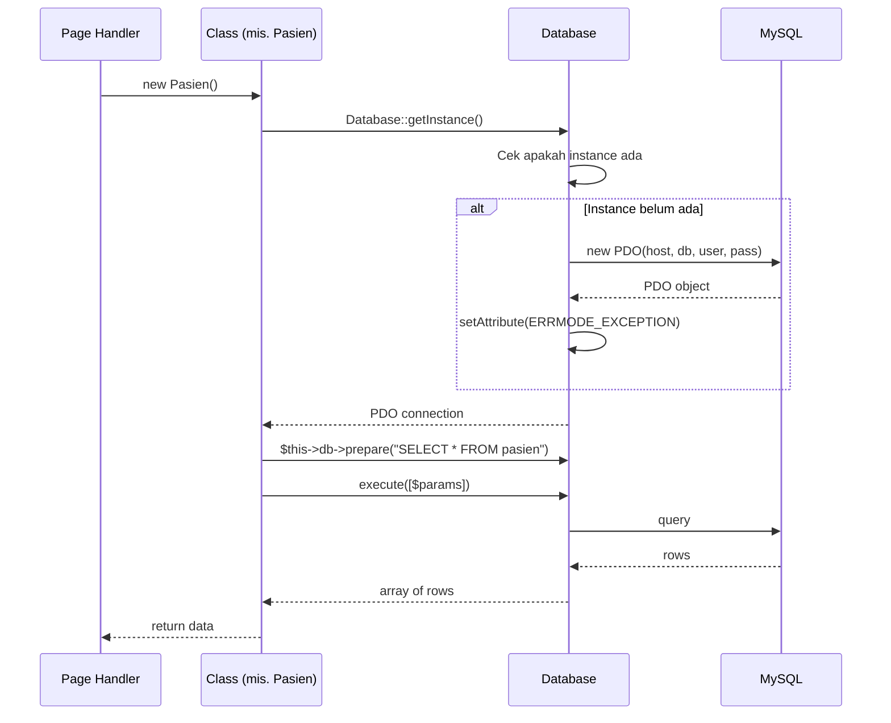

# Architecture

Diagram arsitektur SILK-Swarakarna: struktur direktori + request lifecycle.

## 1. Project Layout

```
silk-swarakarna/
├── src/
│   ├── Database.php
│   ├── Entity/                  (Silk\Entity\*)
│   │   ├── Pasien.php
│   │   ├── Dokter.php
│   │   ├── Layanan.php
│   │   └── Pemeriksaan.php
│   ├── Repository/              (Silk\Repository\*)
│   │   ├── PasienRepository.php
│   │   ├── DokterRepository.php
│   │   ├── LayananRepository.php
│   │   └── PemeriksaanRepository.php
│   ├── Query/                   (Silk\Query\*)
│   │   ├── PasienQuery.php
│   │   ├── DokterQuery.php
│   │   ├── LayananQuery.php
│   │   └── PemeriksaanQuery.php
│   └── Presenter/               (Silk\Presenter\*)
│       ├── PasienPresenter.php
│       ├── DokterPresenter.php
│       ├── LayananPresenter.php
│       └── PemeriksaanPresenter.php
│
├── includes/
│   ├── bootstrap.php
│   ├── config.php
│   └── helpers.php              (format + form helpers)
│
├── public/
│   ├── index.php                (front controller + router)
│   ├── .htaccess
│   └── assets/css/app.css
│
├── views/                       (no namespace, templates)
│   ├── layout/{header,footer}.php
│   ├── errors/404.php
│   └── _placeholder.php
│
├── database/
│   └── silk_swarakarna.sql
│
├── docs/
│   ├── architecture.md          (this file)
│   ├── business-logic.md
│   ├── diagrams/                (flow + UML + component + package)
│   ├── designs/
│   └── agents/
│
├── .ddev/
├── composer.json                (PSR-4 autoload)
├── .env.example
├── .gitignore
├── AGENTS.md
├── DESIGN.md
├── CONTEXT.md
└── README.md
```

## 2. Request Lifecycle

Setiap HTTP request dari browser flow-nya gini:



## 3. Layered Architecture Overview

```
┌─────────────────────────────────────────────────┐
│ views/                  (template HTML, no class)│
│   ↓ uses                                          │
│ Presenter/*           (format data for view)     │
│   ↓ uses                                          │
│ Entity/*              (validation, business rules)│
│   ↓ composition                                   │
│   ├── Repository/*     (CRUD: insert/update/delete)│
│   └── Query/*          (complex reads + generate) │
│        ↓ uses                                      │
│        Database (Silk\Database)                   │
│        ↓ uses                                      │
│        PDO + MariaDB                              │
└─────────────────────────────────────────────────┘
```

## 4. CQRS Rationale (Repository vs Query)

Repository = Command + basic read. Handles:
- `insert()`, `update()`, `delete()` (write operations)
- `findAll()`, `findById()` (simple reads by ID, no JOIN)
- `count()` (simple aggregate, no WHERE)

Query = Read. Handles:
- `searchByName()` (LIKE queries, can be slow at scale)
- `findAllJoined()`, `findByIdJoined()` (multi-table JOINs)
- `findLatest($limit)` (top-N queries)
- `findStatusForUpdate()` (row-level locks in transactions)
- `generateKodeOtomatis()` (computation involving MAX query)
- `countByDate()` (date-filtered aggregates)

Boundary rule: if a query is simple (single table, basic WHERE, no JOIN), it goes in Repository. If it involves JOINs, LIKE, computed values, or row locks, it goes in Query.

## 5. Code Examples

**Entity with Query delegation (Pasien):**

```php
final class Pasien
{
    private PasienRepository $repo;
    private PasienQuery $query;

    public function __construct()
    {
        $this->repo  = new PasienRepository();
        $this->query = new PasienQuery();
    }

    public function generateKodeOtomatis(): string
    {
        return $this->query->generateKodeOtomatis();
    }

    public function search(string $keyword): array
    {
        return $this->query->searchByName($keyword);
    }
    // create, read, update, delete -> repo
}
```

**Presenter pattern:**

```php
final class PasienPresenter
{
    public function __construct(private Pasien $pasien) {}

    public function getListData(?string $keyword = null): array
    {
        $rows = $keyword
            ? $this->pasien->search($keyword)
            : $this->pasien->read();
        return array_map([$this, 'formatRow'], $rows);
    }

    private function formatRow(array $r): array
    {
        $r['tanggal_lahir_fmt'] = format_tanggal($r['tanggal_lahir'] ?? '');
        return $r;
    }
}
```

**Pemeriksaan with transaction (race-safe status update):**

```php
public function updateStatus(string $id, string $newStatus): int
{
    $this->db->beginTransaction();
    try {
        $current = $this->query->findStatusForUpdate($id);  // SELECT ... FOR UPDATE
        if ($current === null) {
            throw new RuntimeException("Pemeriksaan {$id} not found");
        }
        $this->validateTransition($current, $newStatus);
        $n = $this->repo->updateStatus($id, $newStatus);
        $this->db->commit();
        return $n;
    } catch (\Throwable $e) {
        $this->db->rollBack();
        throw $e;
    }
}
```

## 6. Updated Project Layout

> Project layout sudah diperbarui pada **Section 1**. Struktur direktori sekarang memisahkan Entity, Repository, Query, dan Presenter ke dalam subfolder masing-masing di `src/`.

## 7. Composer Autoload (PSR-4)

```json
"autoload": {
    "psr-4": {
        "Silk\\": "src/",
        "Silk\\Includes\\": "includes/",
        "Silk\\Entity\\": "src/Entity/",
        "Silk\\Repository\\": "src/Repository/",
        "Silk\\Query\\": "src/Query/",
        "Silk\\Presenter\\": "src/Presenter/"
    }
}
```

## 8. Class Responsibilities

| Class | Tanggung Jawab | Methods |
|---|---|---|
| `Database` | Koneksi PDO, eksekusi query global | `getInstance()`, `query()`, `execute()`, `lastInsertId()` |
| `Entity\Pasien` | Delegasi ke Repository + Query | `create()`, `read()`, `update()`, `delete()`, `generateKodeOtomatis()`, `search()` |
| `Entity\Dokter` | Delegasi ke Repository + Query | `create()`, `read()`, `update()`, `delete()`, `search()` |
| `Entity\Layanan` | Delegasi ke Repository | `create()`, `read()`, `update()`, `delete()` |
| `Entity\Pemeriksaan` | Transaksi + JOIN + status via Query/Repository | `create()`, `readWithJoin()`, `updateStatus()`, `search()`, `getById()` |
| `Repository\*` | CRUD + simple reads (Command side) | `insert()`, `update()`, `delete()`, `findAll()`, `findById()`, `count()` |
| `Query\*` | Complex reads + computation (Query side) | `searchByName()`, `findAllJoined()`, `findByIdJoined()`, `findLatest()`, `findStatusForUpdate()`, `generateKodeOtomatis()`, `countByDate()` |
| `Presenter\*` | Format data untuk view template | `getListData()`, `formatRow()` |

## 9. Database Connection Pattern



Pattern: **Singleton PDO**. 1 koneksi shared di semua class — hemat resource, gampang di-mock untuk test.
