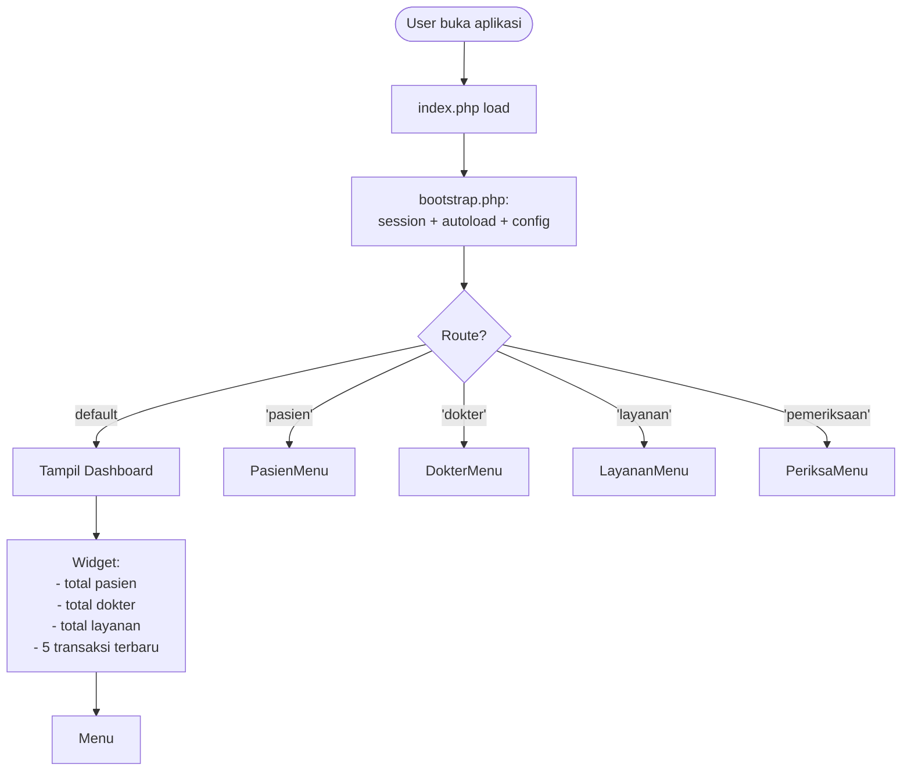
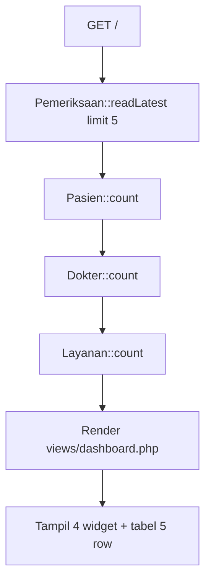
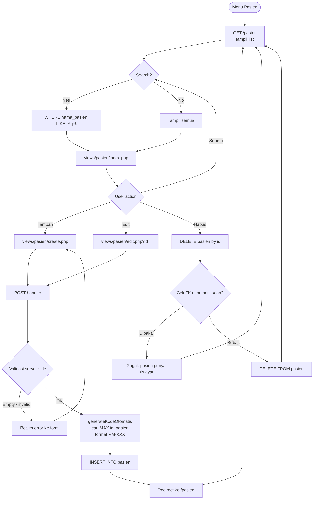
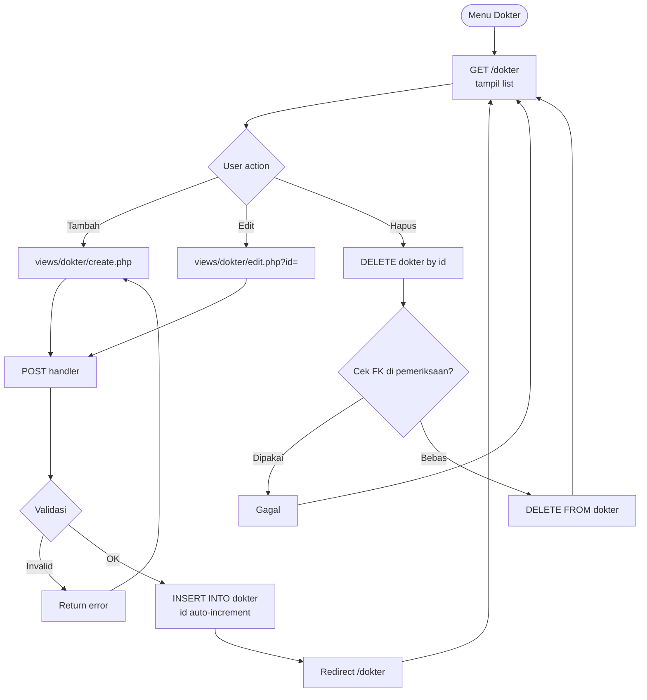
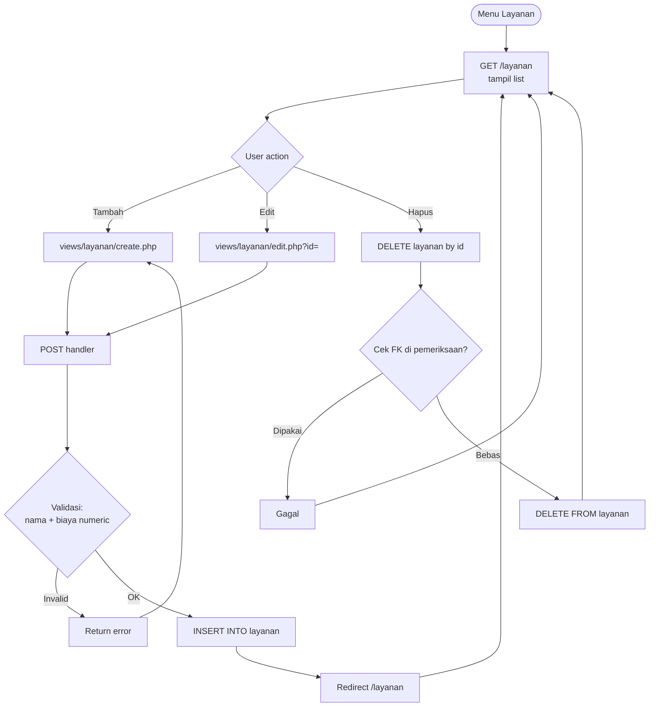
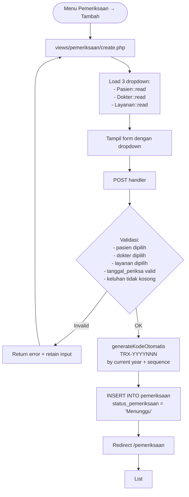
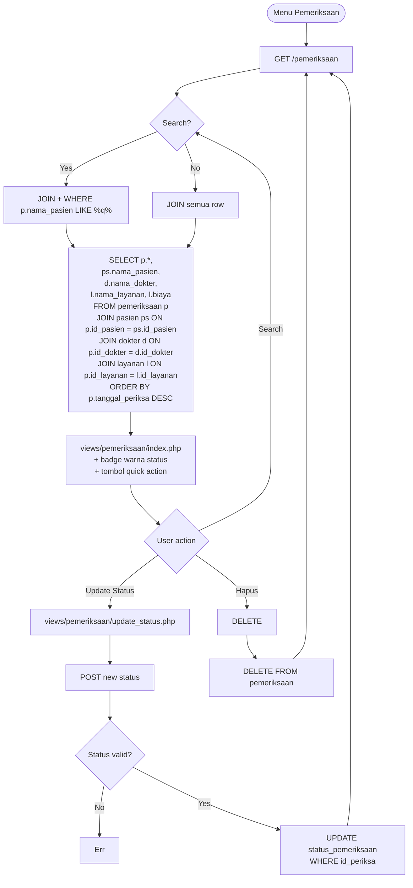
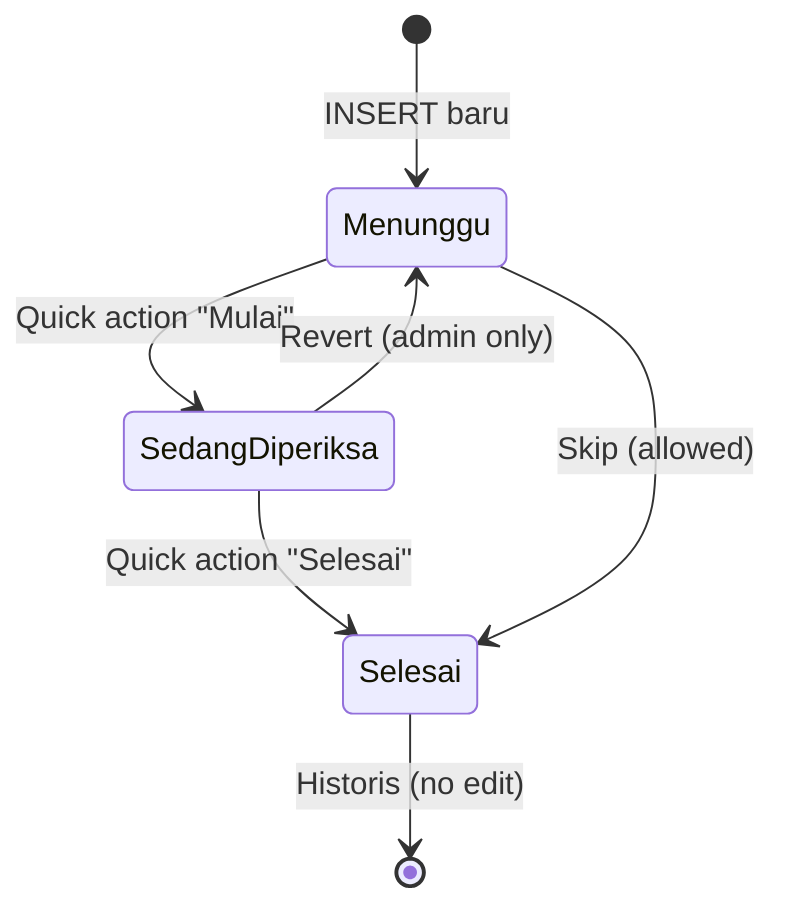
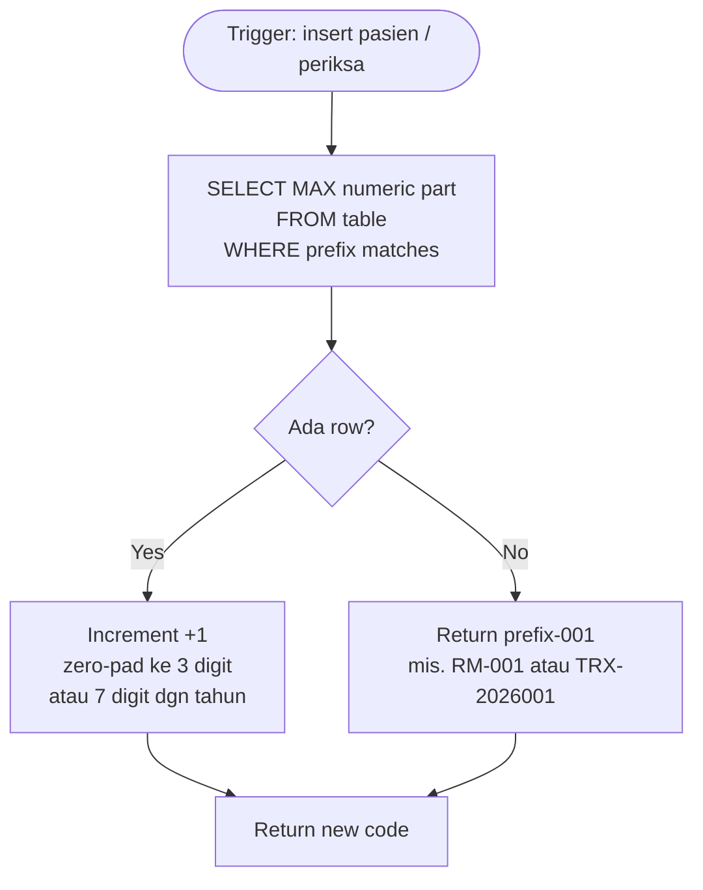
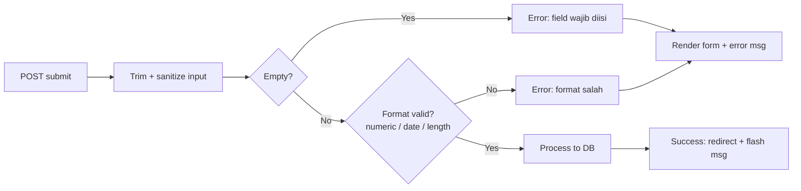

# Business Logic Flow

Flowchart business logic per fitur. Setiap fitur punya alur sendiri.

## 1. High-Level Navigation

## 2. Dashboard

## 3. CRUD Pasien

## 4. CRUD Dokter

## 5. CRUD Layanan

## 6. Transaksi Pemeriksaan (Paling Kompleks)

### 6.1 Create Pemeriksaan

### 6.2 List Pemeriksaan (with JOIN)

### 6.3 Status State Machine

## 7. Kode Otomatis Logic

**Format:**
- Pasien: `RM-001` → `RM-002` → ... (zero-pad 3 digit)
- Pemeriksaan: `TRX-2026001` → `TRX-2026002` → ... (reset tiap tahun, total 10 char)

## 8. Validasi Form Pattern

**Rules per field:**
- `nama_*` → tidak kosong, max 100 char
- `tanggal_lahir` → date valid, tidak di masa depan
- `no_hp` → numeric, 10-15 digit
- `biaya` → numeric, > 0
- `tanggal_periksa` → date valid, tidak sebelum hari ini (opsional, configurable)
