# Business logic flow

Flowchart per fitur. Semua alur ada di sini.

## 1. High-level navigation

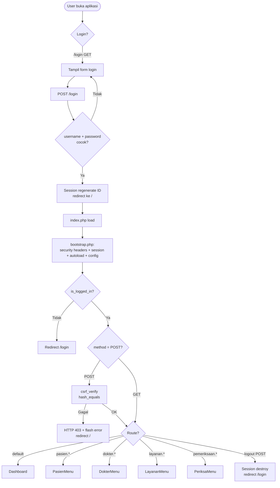

## 2. Dashboard

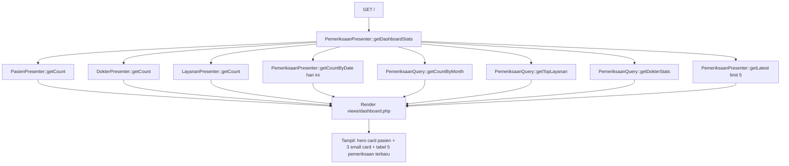

## 3. CRUD Pasien

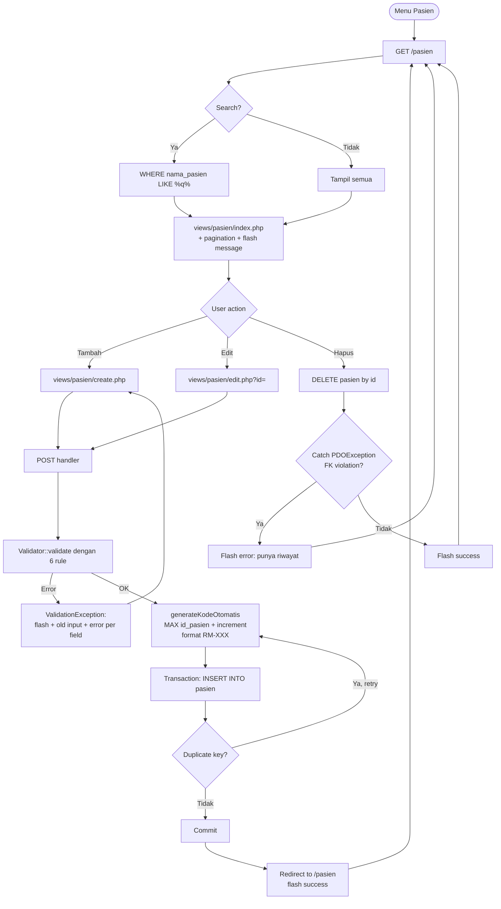

### Fields dan validasi Pasien

| Field | Rule | Keterangan |
|---|---|---|
| `nama_pasien` | Required + MaxLength(100) | Nama pasien |
| `tanggal_lahir` | Required + DateNotFuture | Tidak boleh masa depan |
| `jenis_kelamin` | Required + Enum(['L', 'P']) | Laki-laki atau Perempuan |
| `pekerjaan` | MaxLength(100) | Opsional |
| `golongan_darah` | Enum(['A', 'B', 'AB', 'O']) | Opsional |
| `riwayat_penyakit` | - | Opsional (text) |
| `alergi` | - | Opsional (text) |
| `no_hp` | Required + PhoneFormat | 10-15 digit |
| `alamat` | Required + MaxLength(255) | Alamat lengkap |

## 4. CRUD Dokter

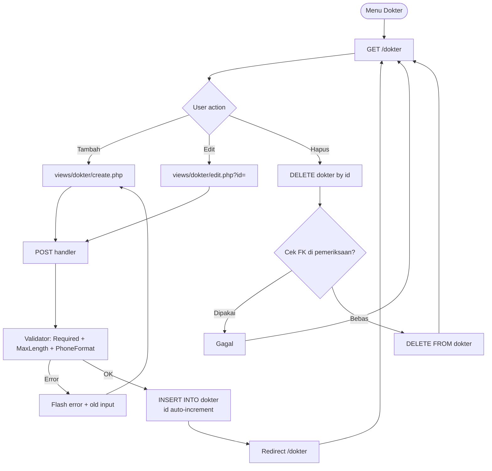

## 5. CRUD Layanan

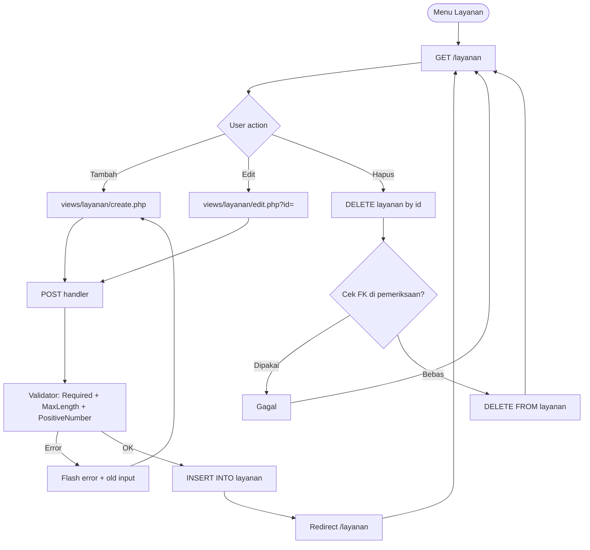

## 6. Transaksi Pemeriksaan

### 6.1 Create

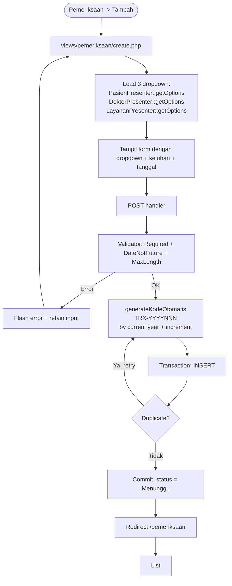

### 6.2 List with JOIN

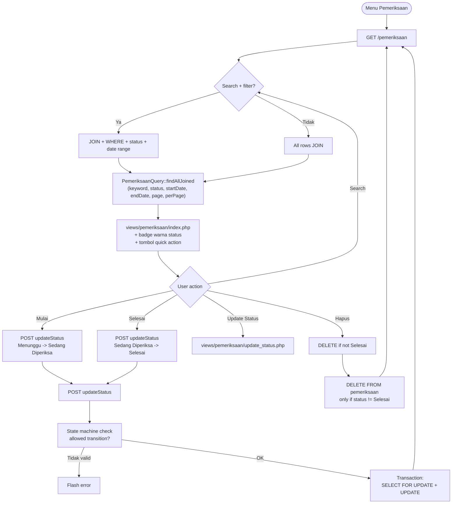

### 6.3 Status state machine

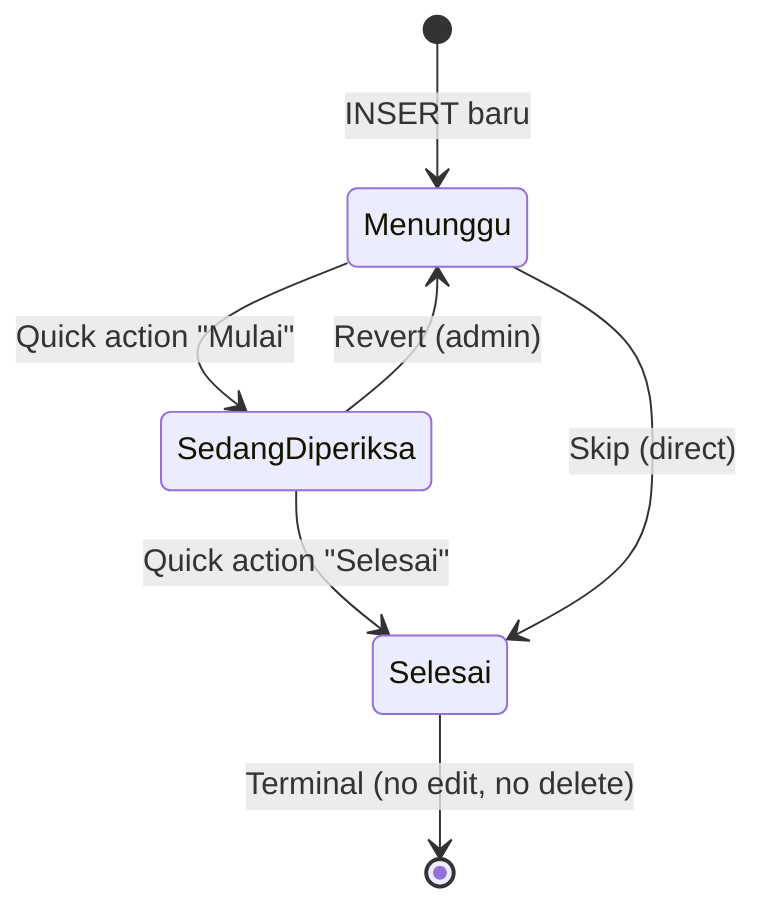

Transitions matrix:

| From | To | Method |
|---|---|---|
| Menunggu | Sedang Diperiksa | POST button "Mulai" |
| Menunggu | Selesai | Skip, direct |
| Sedang Diperiksa | Menunggu | Revert |
| Sedang Diperiksa | Selesai | POST button "Selesai" |
| Selesai | - | Terminal |

Race protection: `updateStatus` wraps in transaction with `SELECT ... FOR UPDATE`. Two concurrent clicks cannot race.

## 7. Kode otomatis logic

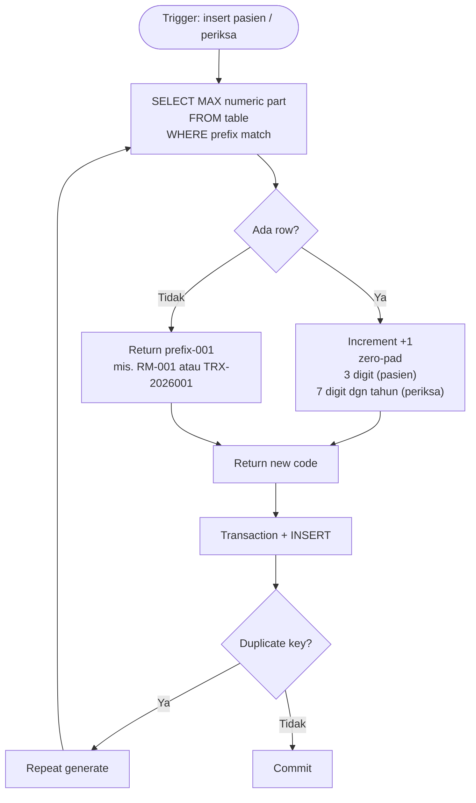

Format:
- Pasien: `RM-001` -> `RM-002` (zero-pad 3 digit)
- Pemeriksaan: `TRX-2026001` -> `TRX-2026002` (reset tiap tahun, total 10 char)

## 8. Validasi form

```mermaid
flowchart LR
    A[POST submit] --> B[Entity create/update method]
    B --> C[Validator::validate<br/>data vs rules array]
    C --> D{Rule->validate<br/>return null?}
    D -->|Tidak (ada error)| E[ValidationException<br/>field => error map]
    D -->|Ya (null)| F[Process to DB]
    E --> R[Router catch: flash + old input<br/>redirect back]
    F --> OK[Commit + redirect + flash success]
```

### Rule engine

Each field gets an array of Rule objects. Validator iterates, first error per field stops.

| Class | validate() logic |
|---|---|
| `Required` | null, empty string, empty array -> error |
| `MaxLength` | strlen > max -> error |
| `DateNotFuture` | string date > today -> error |
| `PhoneFormat` | not 10-15 digit numeric -> error |
| `Enum` | not in allowed array -> error |
| `PositiveNumber` | <= 0 -> error |

Rule interface:

```php
interface Rule {
    /** null = valid, string = error message */
    public function validate(mixed $value): ?string;
}
```

Validator:

```php
$errors = [];
foreach ($rules as $field => $fieldRules) {
    foreach ($fieldRules as $rule) {
        $error = $rule->validate($data[$field] ?? null);
        if ($error !== null) {
            $errors[$field] = $error;
            break; // first error per field
        }
    }
}
if ($errors !== []) {
    throw new ValidationException($errors);
}
```

DB triggers also enforce date constraints:
- `trg_pasien_check_tanggal_lahir_bi/bu` -- pasien tanggal_lahir must not be future
- `trg_periksa_check_tanggal_bi/bu` -- pemeriksaan tanggal_periksa must not be > 1 year future

## 9. Login + CSRF flow

### Login

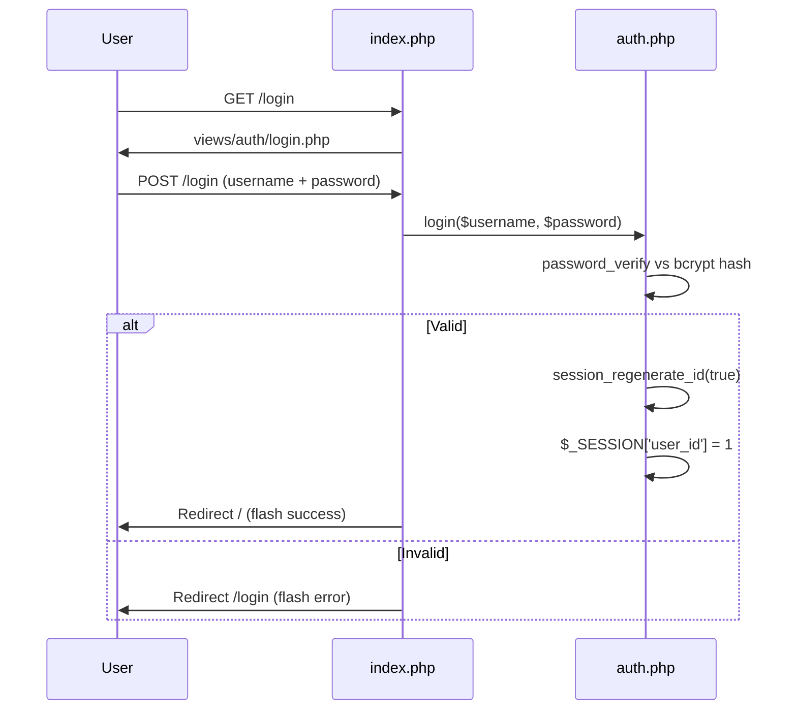

### CSRF

All POST requests go through CSRF check. Flow:

1. `csrf_token()` generates `bin2hex(random_bytes(32))`, stored in `$_SESSION['csrf_token']`.
2. `csrf_field()` renders hidden input `<input type="hidden" name="csrf_token" value="...">`.
3. All forms include `<?= csrf_field() ?>`.
4. Router calls `csrf_verify()` at top of every POST.
5. `csrf_verify()` compares `$_POST['csrf_token']` vs `$_SESSION['csrf_token']` using `hash_equals` (constant-time).
6. On mismatch: HTTP 403 + redirect `/` + flash error.

```php
// includes/auth.php
function csrf_verify(): bool
{
    $token = $_POST['csrf_token'] ?? '';
    return !empty($_SESSION['csrf_token'])
        && hash_equals($_SESSION['csrf_token'], $token);
}
```

Logout is POST-only (prevents CSRF via ``).

## 10. Sidebar collapse flow

```mermaid
flowchart TD
    A[Toggle button clicked] --> B{window.innerWidth < 992?}
    B -->|Ya| C[Treat as offcanvas: show drawer]
    B -->|Tidak (desktop)| D[Toggle class sidebar-collapsed on html]
    D --> E[localStorage.setItem<br/>sidebar-collapsed = 1/0]
    C --> F[Bootstrap Offcanvas.show]
```

On page load, inline script in `<head>` reads localStorage before CSS renders (prevents FOUC):

```js
if (localStorage.getItem('sidebar-collapsed') === '1') {
    document.documentElement.classList.add('sidebar-collapsed');
}
```

Collapsed mode: sidebar width 280px -> 60px. All text hidden. Icons centered. Logout button circular.

## 11. Command palette flow

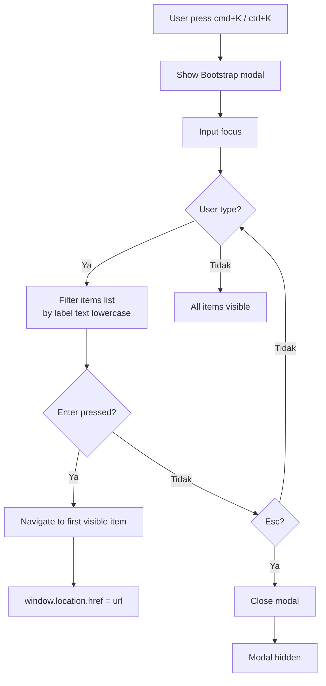

5 items: Dashboard, Pasien, Dokter, Layanan, Pemeriksaan. Click also navigates.
