# Business logic flow

Flowchart per fitur. Semua alur ada di sini.

## 1. High-level navigation

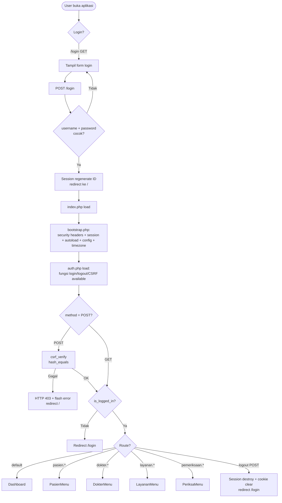

Urutan eksekusi: `bootstrap.php` → `auth.php` → CSRF check (POST only) → auth gate → route resolution → action/view.

## 2. Dashboard

```mermaid
flowchart TD
    A[GET /] --> B[PemeriksaanPresenter::getDashboardStats]
    B --> C[PasienPresenter::getCount]
    B --> D[DokterPresenter::getCount]
    B --> E[LayananPresenter::getCount]
    B --> F[Pemeriksaan::countByDate hari ini]
    B --> G[PemeriksaanQuery::getCountByMonth tahun ini]
    B --> H[PemeriksaanQuery::getTopLayanan]
    B --> I[PemeriksaanQuery::getDokterStats]
    B --> J[PemeriksaanPresenter::getLatest limit 5]
    B --> K2[PemeriksaanPresenter::getMonthlyRevenue tahun, bulan ini]
    C & D & E & F & G & H & I & J & K2 --> M[Render views/dashboard.php]
    M --> N[Tampil: hero card pasien gradient + 4 small card (termasuk Pendapatan Bulan Ini) + tabel 5 pemeriksaan terbaru]
```

`getDashboardStats` aggregates 9 sumber data dalam 1 call (no N+1). `pemeriksaan_bulan_ini` = sum `count_by_month[1..currentMonth]`. `pendapatan_bulan_ini` = `SUM(l.biaya)` di current month via `getDateRangeTotal`. Hero card pasien: gradient teal + sparkline + trend badge + 2 CTA buttons. Card "Pendapatan Bulan Ini" format `format_rupiah()`, link "Lihat Laporan" ke `/pemeriksaan/cetak`.

## 3. CRUD Pasien

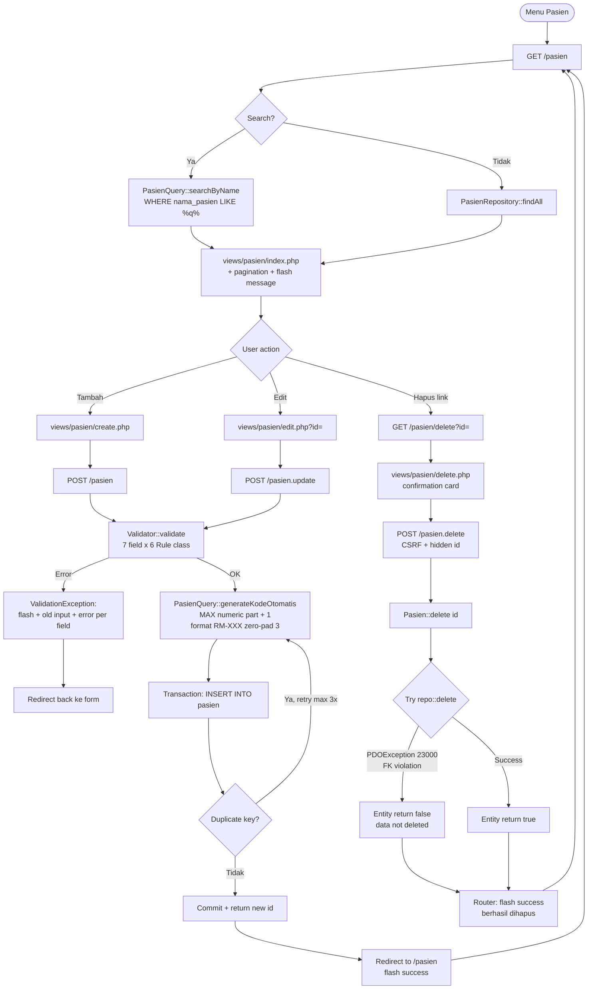

Note: router ignores entity return value untuk delete method, selalu set flash success. Pasien dengan riwayat pemeriksaan tidak benar-benar terhapus (FK violation ditahan entity), tapi user melihat pesan "berhasil dihapus". Pemeriksaan FK ada di `pemeriksaan.id_pasien`.

### Fields dan validasi Pasien

| Field | Rule | Keterangan |
|---|---|---|
| `nama_pasien` | Required + MaxLength(100) | Nama pasien |
| `tanggal_lahir` | Required + DateNotFuture | Tidak boleh masa depan |
| `jenis_kelamin` | Required + Enum(['L', 'P']) | Laki-laki atau Perempuan |
| `pekerjaan` | MaxLength(100) | Opsional |
| `golongan_darah` | Enum(['A', 'B', 'AB', 'O']) | Opsional |
| `riwayat_penyakit` | - | Opsional (text) |
| `alergi` | - | Opsional (text) |
| `no_hp` | Required + PhoneFormat | 10-15 digit angka |
| `alamat` | Required + MaxLength(255) | Alamat lengkap |

7 field divalidasi menggunakan 6 Rule class (Required, MaxLength, DateNotFuture, PhoneFormat, Enum, PositiveNumber -- PositiveNumber tidak dipakai Pasien).

## 4. CRUD Dokter

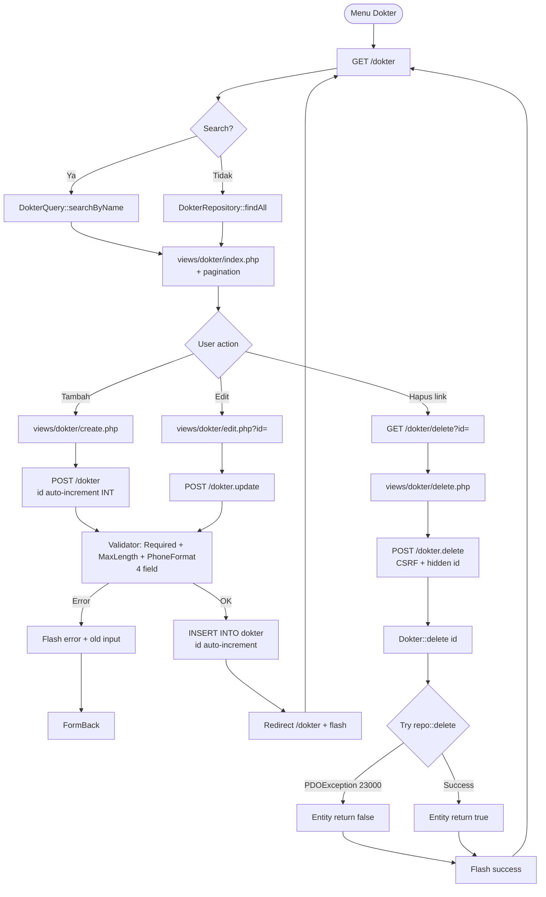

Default value: `spesialisasi` kosong/empty → diset `'THT'` oleh entity sebelum insert.

## 5. CRUD Layanan

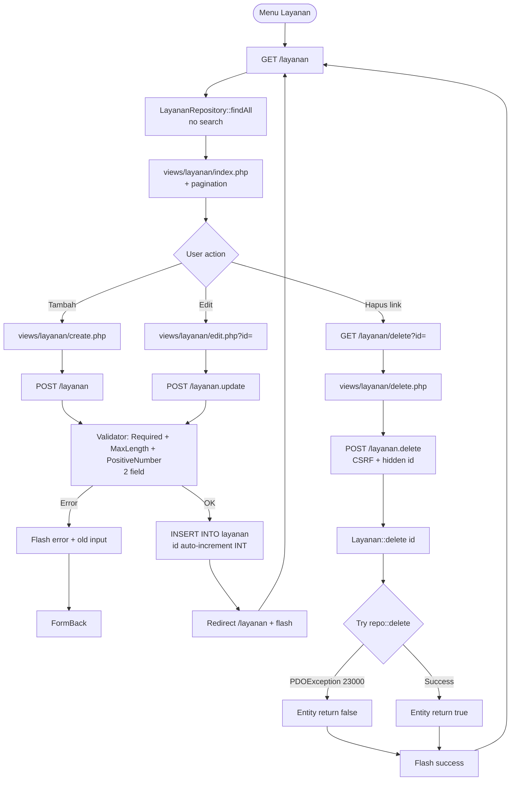

Tidak ada search di Layanan. Biaya: `format_rupiah()` di presenter (Rp 250.000, separator titik).

## 6. Transaksi Pemeriksaan

### 6.1 Create

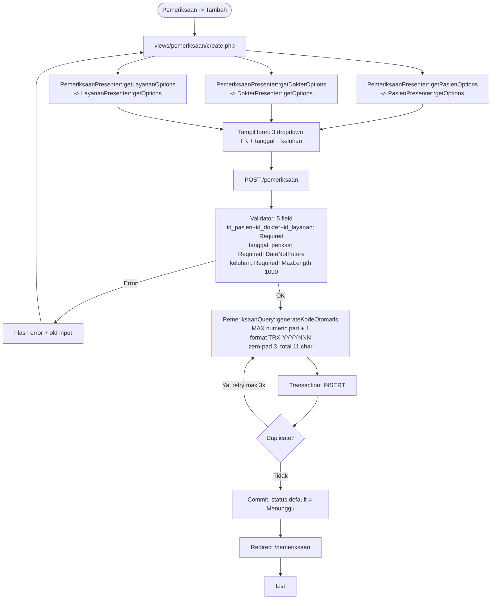

`PemeriksaanPresenter` punya referensi ke 3 presenter lain (Pasien, Dokter, Layanan) lewat constructor injection. Method `getPasienOptions/getDokterOptions/getLayananOptions` delegate ke presenter masing-masing. View cukup instantiate `PemeriksaanPresenter` saja.

### 6.2 List with JOIN + filter

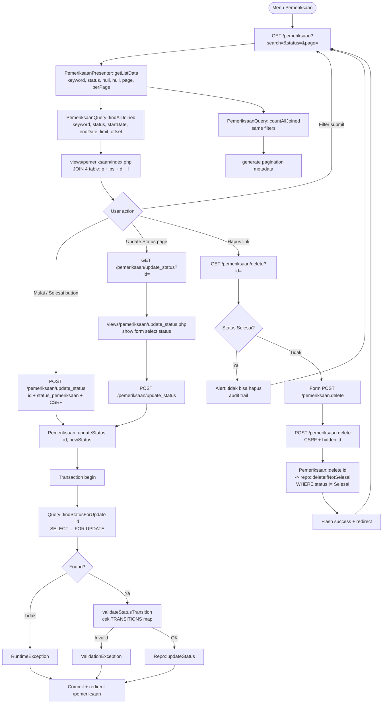

`findAllJoined` signature di Query: `(?string $keyword, ?string $status, ?string $startDate, ?string $endDate, int $limit, int $offset)`. Presenter `getListData` accepts `(keyword, status, startDate, endDate, page, perPage)` dan convert ke `(keyword, status, startDate, endDate, perPage, offset)`. View saat ini hanya pass 2 filter (search, status), startDate/endDate hardcoded null.

### 6.3 Status state machine

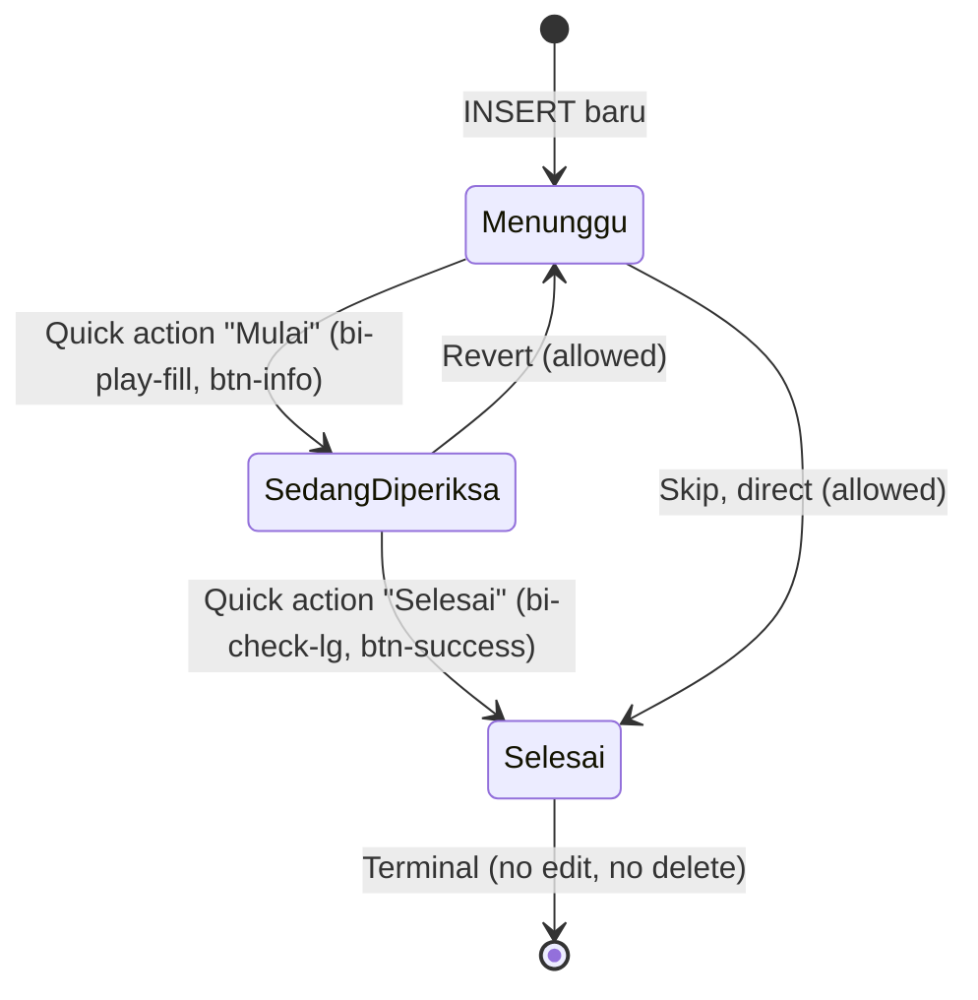

TRANSITIONS matrix (di `Pemeriksaan::TRANSITIONS`):

| From | To | Trigger | Color |
|---|---|---|---|
| Menunggu | Sedang Diperiksa | Quick button "Mulai" | btn-info + bi-play-fill |
| Menunggu | Selesai | Quick button "Selesai" | btn-success + bi-check-lg |
| Sedang Diperiksa | Menunggu | Update Status form | - |
| Sedang Diperiksa | Selesai | Quick button "Selesai" | btn-success + bi-check-lg |
| Selesai | - | Terminal (no transition) | - |

Race protection: `updateStatus` wraps in transaction dengan `SELECT ... FOR UPDATE`. Dua request konkuren tidak bisa race. State transition divalidasi di dalam lock. View baca allowed transitions via `Pemeriksaan::getAllowedTransitions(currentStatus)` → render button untuk masing-masing next status. Selesai = terminal, tidak ada button, tidak ada delete form (alert "audit trail").

## 7. Kode otomatis logic

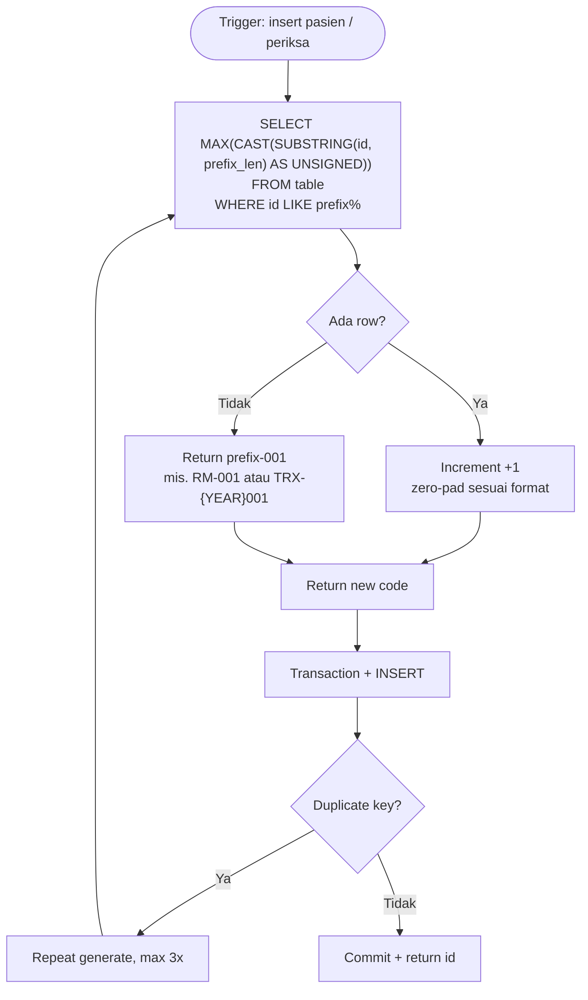

Format:

| Entity | Prefix | Format | Total char | Reset |
|---|---|---|---|---|
| Pasien | `RM-` | `RM-{NNN}` | 6 (RM- + 3 digit) | Tidak |
| Pemeriksaan | `TRX-{YEAR}-` | `TRX-{YYYY}{NNN}` | 11 (TRX- + 4 year + 3 digit) | Ya, per tahun |

Pemeriksaan MAX query: `MAX(CAST(SUBSTRING(id_periksa, 9) AS UNSIGNED))` -- substring dari posisi 9 (start after `TRX-YYYY`), filter `id_periksa LIKE 'TRX-{YEAR}%'`. Race-safe: 3 retry pada duplicate key (PDOException dengan code 23000 atau message contains "Duplicate").

## 8. Validasi form

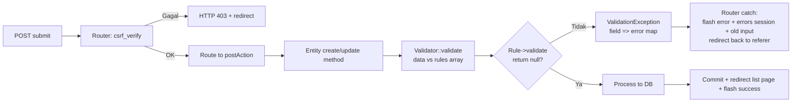

### Rule engine

Each field gets list of Rule objects. Validator iterates per field, first error stops. Accumulate errors, throw `ValidationException` dengan map `field => message` di akhir.

| Class | validate() logic |
|---|---|
| `Required` | null, empty string, empty array → error |
| `MaxLength` | strlen > max → error |
| `DateNotFuture` | string date > today → error |
| `PhoneFormat` | bukan 10-15 digit angka → error |
| `Enum` | tidak ada di allowed array → error |
| `PositiveNumber` | <= 0 atau bukan numeric → error |

Rule interface:

```php
interface Rule {
    /** null = valid, string = error message */
    public function validate(mixed $value): ?string;
}
```

Validator:

```php
$errors = [];
foreach ($rules as $field => $fieldRules) {
    $value = $data[$field] ?? null;
    foreach ($fieldRules as $rule) {
        $error = $rule->validate($value);
        if ($error !== null) {
            $errors[$field] = $error;
            break; // first error per field
        }
    }
}
if ($errors !== []) {
    throw new ValidationException($errors);
}
```

Router catch:

```php
catch (ValidationException $e) {
    redirectBackWithError('Validasi gagal, periksa input', $e->getErrors());
}
```

`redirectBackWithError` set `$_SESSION['flash_error']`, `$_SESSION['errors']`, `$_SESSION['old_input']` lalu redirect ke `HTTP_REFERER` atau `/`. View pakai `old_input('field')`, `has_error('field')`, `error_for('field')` untuk render form. Setelah render, `unset($_SESSION['old_input'], $_SESSION['errors'])`.

DB triggers juga enforce date constraints:
- `trg_pasien_check_tanggal_lahir_bi/bu` -- pasien `tanggal_lahir` must not be future
- `trg_periksa_check_tanggal_bi/bu` -- pemeriksaan `tanggal_periksa` must not be > 1 year future

Defense in depth: PHP Validator + DB trigger.

## 9. Login + CSRF flow

### Login

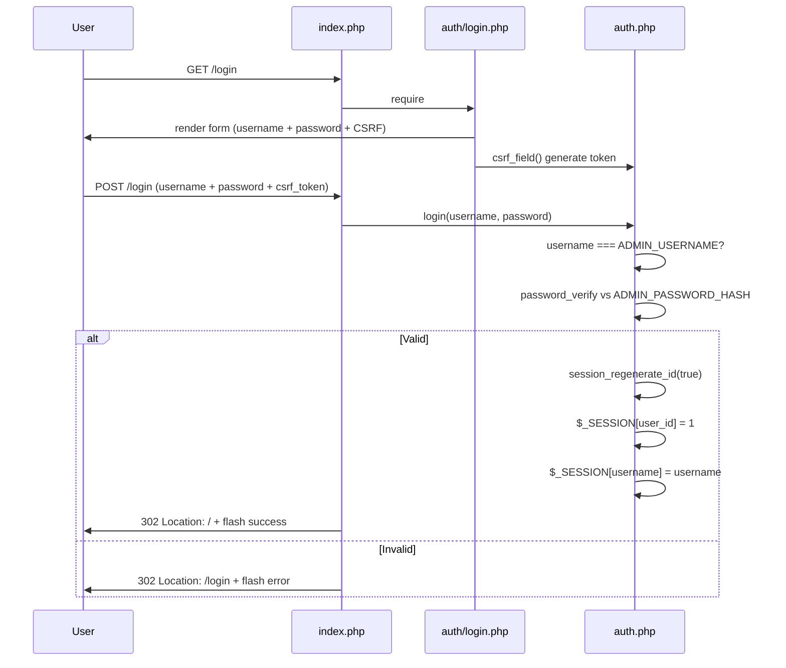

Hardcoded credentials: `ADMIN_USERNAME = 'admin'`, `ADMIN_PASSWORD_HASH = bcrypt('admin123')`. Production: replace dengan users table + `password_hash` + `password_verify`. Login page standalone (tidak pakai layout/sidebar), langsung render form di tengah layar.

### CSRF

Semua POST melewati CSRF check. Flow:

1. `csrf_token()` generate `bin2hex(random_bytes(32))`, store di `$_SESSION['csrf_token']` (reused untuk session lifetime).
2. `csrf_field()` render hidden input `<input type="hidden" name="csrf_token" value="...">`.
3. Semua form POST include `<?= csrf_field() ?>`.
4. Router panggil `csrf_verify()` di top index.php SEBELUM dispatch ke postAction: setiap POST wajib lulus.
5. `csrf_verify()` compare `$_POST['csrf_token']` vs `$_SESSION['csrf_token']` pakai `hash_equals` (constant-time).
6. Gagal: HTTP 403 + set `$_SESSION['flash_error']` + redirect `/`.

```php
// includes/auth.php
function csrf_verify(): bool
{
    $token = $_POST['csrf_token'] ?? '';
    return !empty($_SESSION['csrf_token'])
        && hash_equals($_SESSION['csrf_token'], $token);
}
```

Logout POST-only. GET `/logout` no-op. Cegah CSRF via ``. Logout button di sidebar pakai POST form + CSRF field.

## 10. Sidebar collapse flow

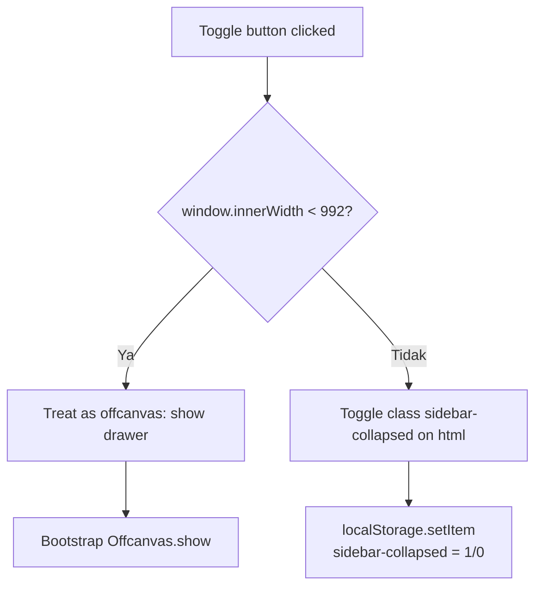

Toggle button di topbar (`#topbarToggle`). Inline script di `views/layout/footer.php`.

Page load, inline script di `<head>` (header.php) baca localStorage sebelum CSS render, cegah FOUC:

```js
if (localStorage.getItem('sidebar-collapsed') === '1') {
    document.documentElement.classList.add('sidebar-collapsed');
}
```

Sidebar width: 280px (default) → 60px (collapsed). CSS: `html.sidebar-collapsed .sidebar-dark { width: 60px; }`. Collapsed mode sembunyikan: brand text, link text, section label, profile name/role, logout text. Icon center, logout button jadi circular (32px square). Transition 0.2s ease-out.

## 11. Command palette flow

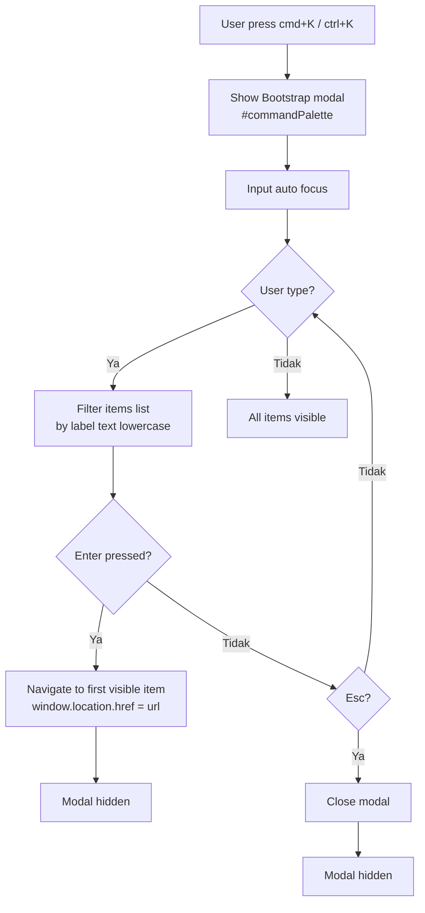

5 nav items: Dashboard, Pasien, Dokter, Layanan, Pemeriksaan. Click juga navigate. Reset on `shown.bs.modal`: input cleared, all items visible, input focus.

## 12. Delete flow summary

Semua entity (Pasien, Dokter, Layanan, Pemeriksaan) pakai 2-step delete:

1. **GET confirmation view**: klik icon trash di list/table -> link ke `/<entity>/delete?id=<id>` -> render confirmation card (icon warning + entity name + form POST).
2. **POST execute**: klik tombol "Hapus" di confirmation card -> form submit ke `/<entity>/delete` dengan CSRF + hidden id -> router dispatch ke entity method -> repo delete -> flash success + redirect list page.

Pemeriksaan punya extra check: jika `status_pemeriksaan === 'Selesai'`, confirmation view skip form, tampilkan alert "tidak dapat dihapus karena merupakan riwayat medis" + tombol kembali. Force POST ke `/pemeriksaan/delete` (bypassing confirmation view) tetap masuk `repo::deleteIfNotSelesai` yang punya `WHERE status_pemeriksaan != 'Selesai'`, return 0 rows affected. Entity return false, tapi router tetap set flash success (router tidak check return value untuk method `delete`).

FK violation (Pasien/Dokter/Layanan dipakai di pemeriksaan): entity catch `PDOException` code 23000, return false. Router check return value (since commit `aa12f07`): if `delete` and `result === false`, `redirectBackWithError("Gagal menghapus {Entity}. Data ini masih digunakan di transaksi lain (terikat relasi).")`. Data tidak terhapus, user lihat error flash yang jelas. Flash error di-set via `$_SESSION['flash_error']` lalu redirect back ke referer (delete confirmation page).

Order penting: `$entity = explode('.', $routeKey)[0];` di-define SEBELUM FK check block, karena dipakai di error message.

## 13. Cetak Laporan

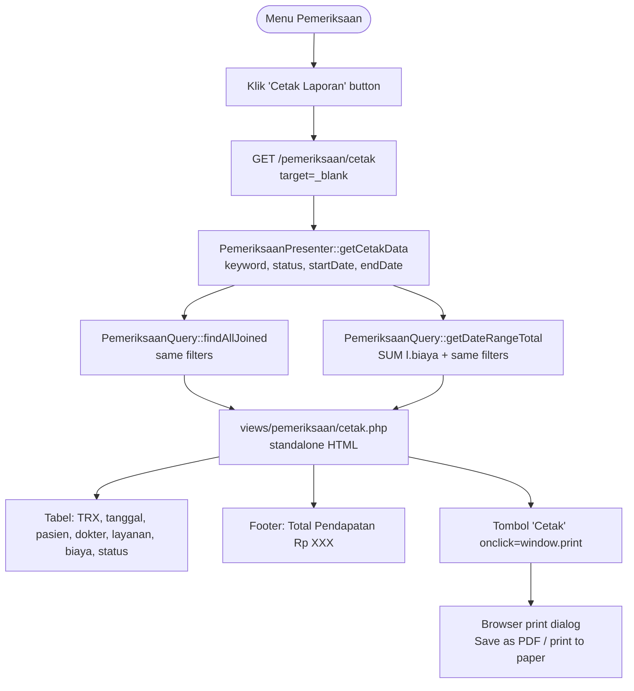

`getCetakData` reuse `findAllJoined` + tambah `getDateRangeTotal`. View standalone (no header/sidebar), inline CSS dengan `@media print` rules hide filter form + tombol. User bisa print langsung atau "Save as PDF" via browser native. Filter form di top: date range, status, search. PerPage default 10000 (no pagination, cetak report selalu full).

## 14. Upload Foto Pasien

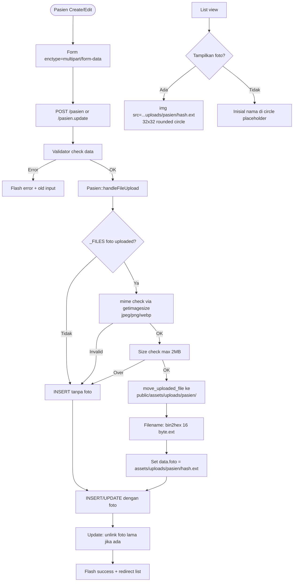

`handleFileUpload` private method di `Pasien` entity. Validasi: file kosong -> skip upload (return null), lanjut insert tanpa foto. File present tapi invalid (bad mime via `getimagesize()`, oversize > 2MB, `move_uploaded_file` fail) -> throw `ValidationException` dengan field `foto` agar user lihat error. Valid -> simpan ke `public/assets/uploads/pasien/<bin2hex>.<ext>`, simpan path relatif di DB. `unlinkOldFoto` di update: reorder save new -> DB -> unlink old (hanya jika DB success). Delete entity: read foto dulu, repo delete, unlink old jika repo delete return true.

Path store di DB: `assets/uploads/pasien/<32-hex>.<ext>`. Folder `public/assets/uploads/` di-`.gitignore`. Web-accessible dari `/assets/uploads/...`.
